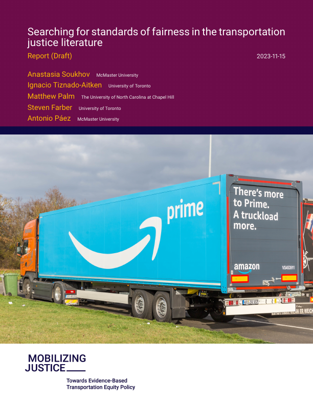
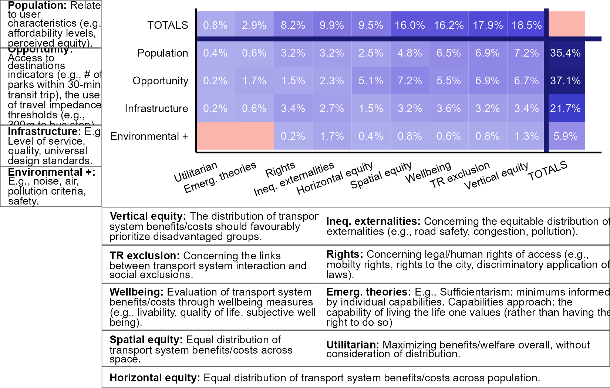
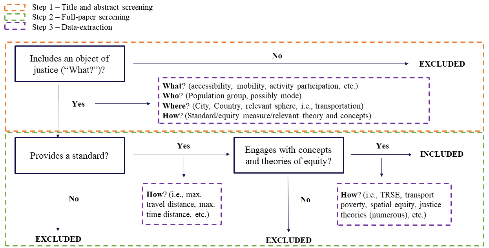
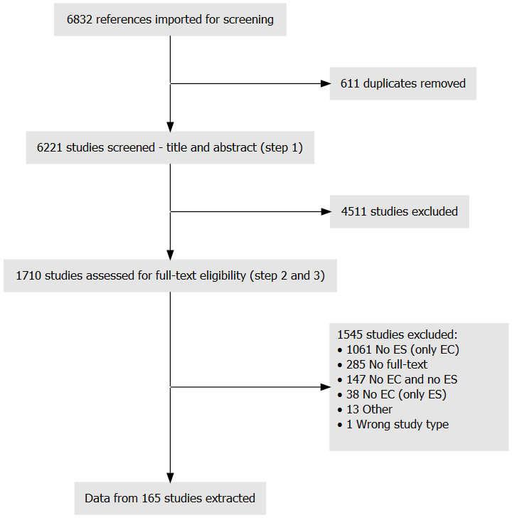
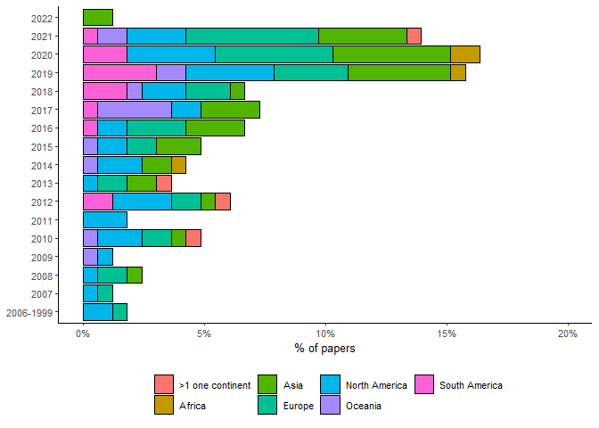
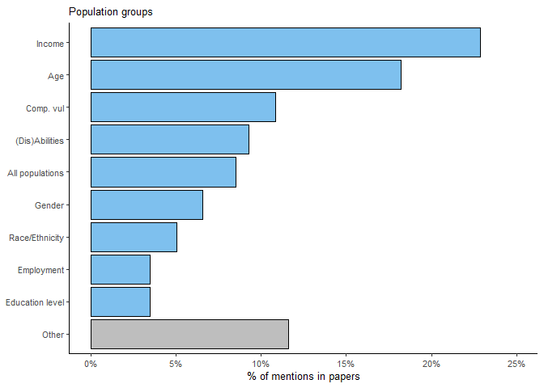
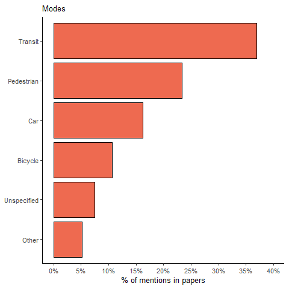

<!-- README.md is generated from README.Rmd. Please edit that file -->

# Searching for standards of fairness in the transportation justice literature

<!-- badges: start -->
<!-- badges: end -->

# Executive Summary

------------------------------------------------------------------------

Modern societies provide people with varying degrees of mobility and
accessibility, from low wage Amazon workers’ depending on infrequent bus
service, to Jeff Bezos taking private flights into space. Societies
implicitly tolerate different levels of inequality in access, though
these levels are occasionally made legible through policy standards. For
example, U.S. transit agencies are required to set and adhere to maximum
levels of disparity in service quality between minority and non-minority
routes as defined by the U.S. Civil Rights Act. In contrast to prior
reviews on how to measure inequality in transportation systems, this
report is concerned with the implied or explicit standards that are used
to judge whether the measured inequalities are fundamentally “fair” or
unacceptable. The present study achieves this objective by scanning the
state of academic knowledge in defining “fairness” in the transport
domain.

Borrowing from philosophers of justice (Jaggar 2009), the report’s
authors ask the following questions about existing standards of fairness
in practice:

- **Where and when** are equity standards applied within the research
  depending on location and time of publication? How are
  context-specific planning processes changing?  
- **Who** benefits and is burdened by transportation systems? Along
  which lines of identity are transportation inequities examined?  
- **What** are those benefits and burdens of transportation systems? Are
  they qualified in sidewalk widths, bus frequency, travel times,
  accessibility, or some other consideration?  
- **How**: are equity standards and inequities measured? Are they
  infrastructure provision thresholds, acceptable pollution levels, or
  some other kind of cut off? How are these studies born out of broader
  notions of justice, i.e. disability rights, environmental justice,
  egalitarianism, or something else?

**Methods**

The authors conducted a scoping review of the literature. The review
involves entering combinations of equity-related keywords into academic
databases to identify relevant studies. The team initially discovered
6,832 references from three diverse databases that they shrunk to a
final corpus of studies using a four-step process:

1.  A total of 611 duplicate studies were removed.  
2.  The researchers, supported by a team of trained research assistants,
    reviewed the remaining titles and abstracts for relevance, with
    4,511 studies excluded for not sufficiently addressing
    transportation equity.  
3.  The full-texts of the remaining 1,711 studies were reviewed. At
    least two trained research assistants reviewed each document, with
    one of the the main researchers (listed as authors) breaking any
    ties. This resulted in 1,545 additional studies being excluded. At
    this stage, studies could be excluded if they did not include any
    standard for, or conceptual grounding for, equity.  
4.  The researchers examined the final corpus of 165 studies to extract
    data on the “When”, “Where”, “Who”, “What”, and “How” of transport
    equity in each study. This included annotating the methods used,
    standards suggested, and inferring conceptualizations of equity that
    may connect to broader notions of justice.

**Results**

**When and Where: the contexts of justice**. Most (60%) studies that
deployed standards for equity stem from the Global North, including
cases from Europe, the U.S., Canada, Australia, New Zealand, Japan, and
Israel. The focus of these studies is on groups seen as disadvantaged
within their respective national contexts, and strive to relate
standards to national policies or issues. In contrast, research stemming
from the Global South tends to adopt international standards in
analyses, such as the U.N.’s Sustainable Development Goals (SDGs).
Within the Global South, studies most commonly cover Asia, followed by
Latin America. Studies in the latter region focus disproportionately on
mobility barriers and the financial affordability of transportation.
Studies pertaining to Africa are numbered, though they cover a broader
scope of issues including informal transportation, citizens’
accessibility needs, and infrastructure development needs. Across the
globe, the studies reviewed apply equity standards overwhelmingly to
urban contexts (85%) and are concerned with a focused set of issues
around the need for and the impacts of daily mobility. Studies on rural
contexts are broader in the topics examined, from the equity of ferry
service in the Philippines to the impacts of road construction on remote
Amazonian communities.

**Who: the subjects of justice.** Income groups are studied most,
followed by age groups, and people with disabilities. People with low
incomes generally experience the least benefits and greatest burdens of
transportation systems, including regarding costs and pollution
exposure. Studies examining equity with respect to age demonstrate how
older adults and children face different levels of access to key
destinations due to differences in their capabilities. Many studies
apply universal design guidelines and laws as equity standards to
evaluate the equity of transportation systems for people with
disabilities. Finally, researchers also frequently develop composite
indices of vulnerability to identify neighbourhoods with high
concentrations of multiple vulnerable populations. This approach is
common when examining environmental justice impacts.

<!--We suggest: Who and What: the tools of mobility. I like our more-->

**What: the tools of mobility.** Most studies that deploy equity
standards apply them to either transit (37%) or pedestrian modes (25%).
Many transit analyses are multimodal in nature, comparing accessibility
by transit to accessibility by automobiles as an implicit standard.
Others combine transit with non-auto modes to examine access for
households without vehicles. These studies focus on delivering equitable
mobility, sometimes in context of also meeting climate goals. However,
they often fail to include explicit minima of service that should be
provided to different populations. In contrast, rights-based,
infrastructure-focused studies apply principles of universal design in
the study of transport systems and related infrastructure.

<!--we suggest: What: the benefits of mobility and accessibility. I like ours more; there is a distinction. -->

**What: the benefits of mobility.** Studies measure either movement
(i.e., trips taken, trip quality, etc.) or the potential for movement
(i.e. accessibility to specific destinations, or generally), with most
studies focused on the latter. Over a quarter of the papers that focus
on accessibility do not consider specific destinations, but instead
concentrate on the accessibility of the trip (i.e., level of service,
barriers of infrastructure) or bundles of destinations. Other studies
are centred on particular destinations considered as essential,
including employment, healthcare, grocery stores, and greenspace. Access
to community support or places of worship, as well as childcare
activities are far less common in the literature reviewed.

<!--we suggest: "How": concepts of justice and standards of fairness. I like ours more - there is a distinction. -->

**How: concepts and standards of justice.** The most common standards
found in the literature, which we term opportunity standards, are
defined using cut offs in access to opportunities (37.2%). Almost as
common is the formulation of standards that use thresholds related to
the perceptions or activities of specific populations (35.8%); we call
these population standards. The latter often includes standards informed
by public health, such as the number of physical activities undertaken
in a week and perceived life satisfaction. Opportunity standards are
evaluated through horizontal equity and spatial equity lenses, while
population ones are evaluated through well-being frameworks. Another
category of standards that emerged from the literature are based on
infrastructure, and these include adherence to universal design
guidelines or specific benchmarks for road network characteristics.
Standards of thsi kind are comparatively less common in the literature
and are often framed in terms of rights, particularly as they relate to
achieving universal design. Infrastructure standards around sustainable
infrastructure (i.e. block lengths or distance between transit stops)
are also evaluated through vertical, horizontal and spatial lenses. The
distribution of studies with respect to the kinds of standards deployed,
and the broader concepts of justice used, are presented in the Figure
below:

<figure>

<figcaption aria-hidden="true">The proportion of equity standards
(vertical axis) within each type of equity conceptualization (horizontal
axis) category.</figcaption>
</figure>

**Calls to Action**

The review conducted for this report provides a snapshot of the state of
knowledge today in terms of how standards of fairness are developed and
deployed. The review is telling both in terms of what it reveals about
the literature, what is covered and what is not. Based on these, the
authors challenge practitioners, researchers, advocates, and governments
to commit to five calls to action:

<!--we suggest:
Call 1: The need for explicit conceptualizations of equity to ground standards. I like Matts!-->

Call 1: Underpin standards in rigorous concepts of justice.

The standards of equity used in research are often weakly linked to any
legally, intellectually, or publicly accepted concepts of justice. Many
standards are arbitrary. For example, the 15-minute city sets a
threshold that is easy to remember, but is this really what is needed to
achieve sufficient sustainable mobility for urban residents, as opposed
to a 10 or 20 minute city? And what conceptualization of human need
should determine what services are essential enough to be included
within this threshold, and for whom?

<!--we suggest:
Call 2: The need for creative systems-thinking approaches to measuring (in)equities I like Matts!-->

Call 2: Develop creative methods for systems-thinking approaches to
equity.

Mixed-methods research can help governments set meaningful standards by
better linking quantitative thresholds with qualitative assessments of
well-being, as well as freedom of movement and perceived access, among
other facets of transportation. Yet most of the research reviewed is
purely quantitative or, to a much lesser degree, purely qualitative. The
constant deployment of metrics Lorenz Curves of Gini coefficients
without research on where such measures need to be to improve quality of
life (i.e., a standard), will not help governments with limited
resources achieve the best possible equity outcomes within their
respective contexts. Mobilizing Justice’s Priority Populations working
group was inaugurated to advance new research in this area.

<!-- We suggested:
Call 3: Data availability as a matter of justice-->

Call 3: Making data available is a matter of justice.

Several areas of critical importance, such as access to care and
community, are under-researched, and the authors suspect this relates to
lack of data on these kinds of destinations. Furthermore, data issues
prevent the application of many methods of equity analyses in the Global
South. The production, availability, transparency, and ownership of data
is a matter of justice on which governments and NGOs should act. In the
Canadian context, Mobilizing Justice’s National Survey working group is
working to advance data practices by conducting the first national
survey on transportation poverty and striving to make data available in
the form of Open Data Products.

<!-- We suggested:
Call 4: Direct and explicit links between standards and experienced outcomes. Sure I like Matt's more!-->

Call 4: Develop more direct and explicit links between standards and
lived experiences.

Linking standards to lived experiences and individual outcomes can help
increase the likelihood of their adoption by governments. Further, they
can help decision makers understand the role of transportation in
improving policy outcomes in other domains like nutrition, physical and
mental health, education, and human development. These links can help
make the standards used in research and policy more comprehensible and
relatable to community members and people with lived experience
navigating unequal mobility systems. Mobilizing Justice launched it’s
Data Driven Standards working group to advance research in this area.

<!-- We suggested:
Towards evaluations of interventions and policies in and across communities-->

Call 5: Rigorously evaluate interventions and policies.

Approximately 10% of the studies reviewed aimed to assess interventions.
Delivering new equity-focused policies and programs that do not actually
advance equity harms communities, metastasizes mistrust, and
delegitimates future efforts to promote transportation justice.
Furthermore, policies that benefit one group of people in one context
may not benefit other groups in other situations. A deep breadth of
equity evaluations is needed to avoid failure and guide policymakers
towards interventions that will work for the communities they serve.
Mobilizing Justice launched its Innovative Pilots working group to begin
filling this gap, through further work is needed.

# Reading guide

------------------------------------------------------------------------

**CONTENTS**

1.  [Just transportation?](#sect1)

Just transportation? Or justice in transportation?

2.  [Setting the stage](#sect2)

The analytical framework for the report.

3.  [Scanning the lay of the land: Methods](#sect3)

The methods used for the literature review.

4.  [The lay of the land: a summary of findings](#sect4)

A summary of the findings.

5.  [A critical appraisal of the lay of the land](#sect5)

Critically appraising the findings.

6.  [Moving forward: calls for action](#sect6)

What next?

7.  [Final remarks](#sect#7)

This is your guide to scanning this document.

If you are primarily interested in the motivation behind this report,
read the first section, [Just transportation?](#sect1)

Keen to jump straight to a description of the conceptual framework for
transport justice? See the second section, particularly the subsection:
[A framework to analyze questions of justice](#sect2.2).

Interested in the methodological details of the literature review? See
[section three](#sect3) and extended information in the
[Appendix](#sect8)

Care more about the results and the critical appraisal of the results
from the review? See sections [four](#sect4) and [five](#sect5),
respectively.

Want to know about our calls for action to move transport equity
analysis and standard-setting substantively towards questions of
transport justice? Read the sixth section [Moving forward: calls for
action](#sect6) and the final concluding section [Final
remarks](#sect7). These sections are geared to both researchers and
decision-makers.

# Glossary

------------------------------------------------------------------------

- **Accessibility**: the potential to reach destinations.

<!-- 
- **Capabilities approach**:  
-->

- **Equality**: a state where every group is treated identically.

- **Equity**: the distribution of benefits and burdens of things among
  the population, with a particular emphasis on those with the least
  advantage and quality in their outcomes.

- **Equity standards**: tools for answering the question of how to
  distribute the burdens and benefits and to whom? When operationalized
  standards effectively define what is fair.

- **Fairness**: a state of being that is achieved when a collective and
  individuals are treated equally and without bias as defined by their
  morals and values.

- **Justice**: A political ideal whereby people give and receive what
  they are due.

- **The temporal-spatial context of justice**: the answers to “Where?”
  and “When?”. What regions, within what countries, spatial contexts,
  point of time, and processes of planning are impacting transport
  systems?

- **The subjects of justice**: the answer to “Who?” is the focus of
  justice.

- **The objects of justice**: the answer to “What?” is the focus of
  justice; what are the things that characterise (in)justice.

- **The methods for justice determination**: the answer to “How?” is
  justice defined and markers towards it tracked.

- **The rationale to justice**: the “Why?”. The rationale connects with
  the context, subject, object and methods used for justice
  determination.

- **Mobility**: The potential to move.

- **Policy**: A deliberate system of principles to guide decisions and
  achieve desired outcomes.

<!--
- **Social exclusion**:  
-->

- **Space-time convergence**: the main product of a transportation
  system is to reduce the time needed to cover a unit of distance; this
  effect makes space and time converge.

<!--
- **Sufficientarianism**:  
&#10;- **Theories of justice**:  
&#10;- **Utilitarianism**:  
-->
# Just transportation?

------------------------------------------------------------------------

> “*To be wealthy and honored in an unjust society is a disgrace.*”  
> — Confucius, The Annalects

The fiery wake of a rocket could be seen ascending, piercing the sky
above West Texas. It was the morning of July 20, 2021, and on board of
the rocket was a small group of four passengers that included Jeff
Bezos, the founder of Amazon and then the world’s richest person
(Harwood 2021). The mission that day was among the first-ever private
suborbital passenger flights, and the adventure (described as “intense”
by one of the passengers) lasted a total of 10 minutes and 10 seconds
(Harwood 2021). In addition to intense, the undertaking was expensive: a
seat for the flight had previously been auctioned for no less than \$28
million USD (Griffin 2021). Before it was even 10:00 am (EDT), Bezos was
back from his excursion, and he took time to declare that this was the
“\[b\]est day ever”. To reporters covering the event he said “I want to
thank every Amazon employee and every Amazon customer, because you guys
paid for all of this” (Johnson and Anilkumar 2021).

Meanwhile, firmly grounded on planet Earth, the employees whom Bezos
thanked for his suborbital jaunt were struggling with some very mundane
problems of their own, and none as lofty as conflicting schedules that
prevented them from flying in rockets (Griffin 2021). According to
reports, people employed directly or indirectly by Amazon for warehouse
or delivery work had, for years, been treated to “inhumane” conditions
(Fung 2018; Scott 2019; Greene 2021), and subjected to surveillance on
the job, degrading schedules that drove drivers to urinate in bottles,
crushing demands for productivity quotas that led to injury, all the
while facing little or no job security. From this perspective, they were
treated less with gratitude and more as disposable inputs to feed
Amazon’s earnings and consumers’ demands (Tung and Berkowitz 2020; BBC
2021; Reese and Alimahomed-Wilson 2022; Middleton 2023).

Coverage of the July 20 launch by the mainstream media was in many cases
uncritical. “We’re going to build a road to space so that our kids and
their kids can build a future” Bezos declared, before adding “…we need
to do that to solve the problems here on Earth” (Johnson and Anilkumar
2021). Few reporters saw it fit to ask what problems the billionaire
planned to solve on Earth, or what kind of future Bezos was trying to
build, and for whose children. In other words, the billionaire was not
confronted with questions about what his trip did *for whom* and *to
whom*. A less dispassionate observer might have been excused for
wondering (possibly aloud) about the basic *fairness* of a man amassing
a nigh unimaginable fortune that allowed him to build and fly his own
spaceship, while masses of his employees were treated as throwaway cogs
in the vast apparatus of his emporium[^1].

The question of *fairness* is not a simple one. Most of us would
probably have been stumped to explain in a precise way just why the
above picture was disturbing. *Justice* is a political ideal based on
the principle that individuals should be treated in a *fair* and
*equitable* manner (Gössling 2016, 2), giving and receiving whatever
they are *due* (Jaggar 2009, 1–2). The political (and contested;
Vanoutrive and Cooper (2019)) nature of the concept presents challenges
that are only narrowly amenable to scientific inquiry. For starters, the
notion that people are “due” something depends on the values of a
society, as embodied in its systems and institutions (Karner et al.
2020a). Values, in turn, are not subject to natural laws, but rather are
the result of intersubjective realities, which is to say illusions whose
legitimacy derives from a collective will to believe. For example,
justice would likely mean something very different to a person in a
democratic society, than to another in a society where they owed their
all to some collective illusion (e.g., the state, or a monarch). As
well, the meaning of “justice” would likely differ in yet another
society where very few owned most, and most owned very little due to a
different illusion (e.g., that wealth equates merit). In these two
hypothetical cases, elucidating the meaning of “fair” would in all
certainty be beyond the dreams of most, since fair would be whatever
organizational structures with power (e.g., the state, the monarch, or
the extremely wealthy) said it was. In contrast, in democratic
societies[^2] individual rights tempered by a collective vision are
valued above the whims of the few. In such a setting, the task of
defining a “just” distribution of the burdens and benefits of
things—from income, to roads, to space travel—quickly becomes muddled,
encumbered even, by the necessity to pay attention to a multitude of
voices, not all of them equally loud.

The rocket that took Bezos to the edge of space is a somewhat rare
example of a transportation technology, a tool of space-time
convergence. By enabling movement at very high speeds, rockets might—one
day, at some indeterminate point in the future—prove essential to the
expansion of the human species beyond our home planet. But in the
present moment, the benefits of a private suborbital flight (e.g., the
joy of movement, the sense of adventure, the awe of seeing Earth from
space) are for a few, whereas the burdens (e.g., the use of
non-renewable resources, the climate-altering emissions) affect us all,
and not evenly at that. The benefits of public transportation, a much
more common transportation technology, are for most, but in many cases
we have penny-pinched these systems, leaving them moribund, while
concentrating the costs on those who have less (Jeff Allen and Farber
2020; Kaeoruean et al. 2020). In a plutocratic society, those with most
can (and often do argue[^3]) that this distribution of burdens and
benefits is fair since both benefits and burdens are earned. The fact
that the likes of Bezos do travel to space is proof that the likes of
Bezos are due those trips. In a democratic society, the members of the
collective might actually agree that large rewards (e.g., space flight)
must be offered to highly qualified individuals (e.g., Bezos) to entice
them to take important responsibilities (e.g., founding and leading
Amazon). The fact that some must give up jobs because it is too time
consuming to reach them by public transportation would constitute proof
that those people should have studied more, been earlier risers, worked
harder (Spurr 2015; Greisman 2017). Again, the members of the collective
might believe that this is a fine state of affairs, having come to this
conclusion of their own accord or after being persuaded by billionaires.
Or, contrariwise, the members of the collective might decide that this
state of affairs is *unjust*: the *values* of those in charge of
defining what is “fair” matter.

Multiple national and cross-national studies suggest that people in many
societies do indeed have some tolerance for inequality (Kiatpongsan and
Norton 2014): it would appear that *some* stratification, as suggested
by Davis and Moore (1945), is perceived as fulfilling a valuable
function. However, extreme inequality is often frowned upon, and can
lead to social dysfunction and other ills (Acemoglu and Robinson 2000;
Taydas and Peksen 2012; Du, King, and Chi 2019; Houle et al. 2022). But
the perceptions of what is “fair” are neither universal or static.
Instead, they are malleable, and can be affected by the existence of
opportunities for social mobility (Shariff, Wiwad, and Aknin 2016;
Artige, Lubart, and Neuss 2019), by exposure to inequality (Schröder
2017; García-Castro et al. 2023), by learned helplessness (Y. Kim, Jung,
and Na 2022), and even by how information about inequality is
communicated to the public (Walker, Tepper, and Gilovich 2021). It
follows that, in general terms, there are at least three different
manners of thinking about inequality[^4]: 1) in a *positive* (or
descriptive) manner, as the current or historic state of the
distribution of benefits and burdens of things; 2) also descriptively,
as the *perceptions* about the distribution of those benefits and
burdens; and 3) normatively (or prescriptively), as the desired or ideal
state of the same. Clearly, the three may coincide (e.g, if the
perceived levels of inequality matched actual inequality and also how
much of it the public desired). However, they do not necessarily have
to, and in many cases will differ from one another. Measuring inequality
as it is and in the most objective way possible, is an essential task to
decide whether there is a need to develop inequality-related policies to
increase fairness. In turn, measuring the perceptions of inequality, in
the most accurate way possible, may be important to achieve sufficient
public buy-in in order to enhance the chances that given policies will
succeed.

Transportation systems, as a class of essential technologies that
facilitate or impede social inclusion and activity participation
(Church, Frost, and Sullivan 2000; Lucas, Grosvenor, and Simpson 2001;
Social Exclusion Unit 2003; Cass, Shove, and Urry 2005; Casas 2007;
Preston and Raje, n.d.; Páez et al. 2009), have increasingly come into
focus from the perspective of equity. In response to this focus, a
lively and rapidly growing literature has emerged on the topic (see
*inter alia* (Karel Martens 2016; Di Ciommo and Shiftan 2017; Guo et al.
2020; Karner et al. 2020a; Vecchio, Tiznado-Aitken, and Hurtubia 2020;
R. H. M. Pereira and Karner 2021; Wee and Mouter 2021; Zhang and Zhao
2021; E. Desjardins, Higgins, and Paez 2022; Karner, Pereira, and Farber
2023)). A cynical rationale for this interest could be that keeping
track of objective and perceived inequalities can serve *at the very
least* as a gauge of social discontent (as Chilean authorities
discovered to their woe when an increase in Santiago Metro’s fares
became a flashpoint for social inequalities, and sparked a period of
massive demonstrations and unrest in October 2019; (BBC News, Latin
America 2019; Díaz Pabón and Palacio Ludeña 2021)). More optimistically,
in democratic systems, tracking objective and perceived inequalities
could be of interest for governing bodies to respond to popular demands
for fairness. Several challenges arise when approaching this endeavor.
The notorious complexity of transportation systems is one of them:
transport systems simultaneously move people, goods, and information.
Emerging technologies and service models can swiftly change the balance
of benefits and burdens among a population (Guo et al. 2020), turning
both users and service providers into digital rentiers (Birch and
Cochrane 2022). The benefits and burdens of transportation systems are
diffuse over space and time. For example, transportation systems
engineered to offer higher mobility for people *somewhere*, can
simultaneously cut others off from essential opportunities *elsewhere*,
as Raje (2004) poignantly illustrated with examples of infrastructure in
the UK. Furthermore, the shades of policies past can continue to haunt a
region and even the planet for decades or longer, as shown by the legacy
of displacement and decay caused by urban highways all across the US
(Archer 2020) and the time horizon for the impacts of climate change to
be fully felt (Markolf et al. 2019).

But complexity is no excuse to shirk the task.

The objective of this report is to scan the state of knowledge in terms
of defining and operationalizing “fairness” in the transportation
domain. Much research has been devoted to the issues of *measuring*
equity in transportation, including (among many others) Ramjerdi (2006),
A. Delbosc and Currie (2011a), T. F. Welch and Mishra (2013), Karel
Martens, Bastiaanssen, and Lucas (2019), and Pritchard, Zanchetta, and
Martens (2022). Further, there are multiple sources that discuss the
conceptual and philosophical foundations of equity and fairness in
transportation (e.g., Karel Martens 2016; R. H. M. Pereira, Schwanen,
and Banister 2017; Vanoutrive and Cooper 2019). Finally, previous
reviews of planning documents have investigated equity from narrowly
scoped perspectives, such as accessibility (Boisjoly and El-Geneidy
2017) or a particular mode of transportation \[e.g., cycling; Doran,
El-Geneidy, and Manaugh (2021)\]. These inquiries are valuable to
scholars, planning agencies, the public, and decision-makers alike, and
the present review will tread similar, but not completely overlapping
ground. In our estimation, there remains a gap in the literature in
terms of understanding how standards for equity are developed and
implemented in the transportation domain. In contrast, we do know that
adoption of equity concepts in planning practice has lagged developments
in academic work (R. H. M. Pereira and Karner 2021; Boisjoly and
El-Geneidy 2017; Doran, El-Geneidy, and Manaugh 2021; Linovski 2020;
Litman 2022).

To illustrate this gap, we note how Oswald Beiler and Mohammed (2016),
in their exploration of transport equity, cite the following strategies
identified by the US DOT to address matters of justice \[p. 287\]:

- Reduce adverse human health and environmental effects on minority and
  low-income populations.
- Include all potentially affected communities in the transportation
  decision-making process.
- Ensure that minority and low-income populations receive equitable
  benefits.

While commendable, the strategies are too vague, which means it is
possible to implement them in a myriad ways, either genuinely to comply
with the spirit of justice, or else performatively to deceive it
(McCullough and Erasmus 2023). Some relevant questions include: how much
should the adverse effects be reduced? To zero? Or to some tolerable
level of adversity greater than zero? What should that level be? What
are the criteria for deciding that a community is “potentially
affected”? What benefits should be distributed? Should the benefits be
based on simple population weights? Or, contrariwise, should more
deprived individuals be eligible for a larger share of the benefits?

These questions boil down to the development and use of *standards* for
transportation justice. The term “standard” connotes “something set up
and established by authority as a rule for the measure of quantity,
weight, extent, value, or quality”[^5]. How much pollution is allowed to
be generated, and where, depends on who is affected, and how much health
is valued overall, as well as by whom. For example, firms may or may not
adopt lower standards for the emission of pollutants in poorer areas; it
might be that poor people end up being relegated to areas that already
had lower emission standards (Gouldson 2006). Regardless of the cause,
the result is the same: pollution tends to be worse were poorer people
are (Deluca, Buist, and Johnston 2012).

Supporting the creation of (more) just transportation systems involves
understanding the production and management of transportation benefits
and costs; how they are distributed; and what values are implemented
(and by whom) in the form of standards (R. H. M. Pereira, Schwanen, and
Banister 2017; Sheller 2018; R. H. M. Pereira and Karner 2021). Thus,
for this review we engage the literature with the following questions in
mind: 1) what is our current understanding of the things that
transportation systems do, for whom, and to whom; 2) what does the
literature say about the distribution of the benefits and costs of
transportation systems; and 3) what values are embodied in normative
statements about said distribution. Ultimately, this review aims to
collate the existing academic knowledge on the matter, and present it in
a manner useful to support the development and implementation of
standards for equity in transportation planning and policy. In this, we
aim to provide relief to planners, especially in those places where
calls for justice are explicitly made through legislation[^6].

The rest of this report is structured as follows.

After this introduction, we set the stage for our investigation by
laying out some important definitions. We then describe the methods used
for searching, selecting, and reviewing the relevant literature. This is
followed by a description of the findings from the review, which is then
appraised critically. We conclude with some calls for action to improve
the practice of setting and using standards of fairness for
transportation justice.

# Setting the stage

------------------------------------------------------------------------

> “*Man’s capacity for justice makes democracy possible, but man’s
> inclination to injustice makes democracy necessary.*”  
> ― Reinhold Niebuhr

> “*Never forget that justice is what love looks like in public*.”  
> ― Cornel West

## Justice, equity, fairness, and standards

In the introductory paragraphs we used the terms “justice”, “fairness”,
and “equity” relatively loosely. This was done purposefully. As we
noted, people often have strong intuitions of what is “fair”, “just”,
and “equitable”. These conceptions may or may not match those of the
authorities who set the standards of fairness. But in democratic
societies, the authority of political leaders, bureaucrats, planners,
and all those charged with the business of governing, derives from the
will of the people. It is therefore important to explicitly state how we
plan to use these words, to clearly spell out our intuitions of
“justice”, “fairness”, and “equity”. A clear mutual understanding of
these concepts is essential for constructive debate, and for
participants of a democratic society to be effective arbiters of what is
just.

Let us begin by stating that justice is an end goal, that is, a
desirable state of affairs that we are morally obligated to achieve.

It is said that justice is attained when people “give and receive
whatever they are due” (Jaggar 2009, 1–2), and it ceases to exist when
there are persons or groups that are denied “access to the opportunities
they need to lead a meaningful and dignified life” (Karner et al. 2020b,
440). Justice is a fluid concept, because it depends on the desirability
of different states of affairs, which may change between populations and
over time. That said, it is possible to distinguish several forms of
justice, including those listed below (see Jaggar 2009; R. H. M.
Pereira, Schwanen, and Banister 2017; Karner et al. 2020b).

**Retributive justice** is concerned with the proportional retribution
of wrongdoers with relation to legitimate punishers and the innocent
(Walen 2023).

**Reparative (or restorative) justice** focuses on the reparation of
caused harm; it centers ‘reintegrative shaming’ to restore victims,
wrongdoers, and the community according to moral values (Tyler 2006).

**Procedural justice** strives to ensure that the views and preferences
of all stakeholders are fairly accounted for in the decision-making and
inter-personal procedures affecting their lives and communities (Tyler
2006).

**Distributive justice** is perhaps the most commonly studied form of
justice (see Jaggar 2009, 2; R. H. M. Pereira, Schwanen, and Banister
2017), and its main concern is the way the benefits and burdens of the
tangible and intangible products of society are collected by different
segments of a population.

It might be argued that all of the above touch on forms of distributive
justice. Retributive justice, for example, could be framed as being
concerned with the distribution of the benefits and burdens of being a
member of society; the way it is usually achieved is by distributing
intangibles of a society’s moral values like “freedom” (e.g., of
movement, of association) as benefits, and/or the distribution of
tangible resources as burdens (e.g., fines as a punishment). Reparative
justice could look like the distribution of benefits and burdens to
redress past wrongs, for example by asking those who have benefited from
said wrongs, even if unwittingly, to shoulder a bigger fiscal burden in
order to cover programs that mete benefits to those who are still harmed
by past wrongs. Procedural justice could be the distribution of the
benefits (e.g., the right to voice an opinion as a recognized
stakeholder in the process) and burdens (e.g., the effort required to
develop an educated opinion) of the processes that lead to decisions
with collective consequences.

We can then speak of the *purposes* of distributive justice: to mete out
retribution *fairly*, to repair past harms, and to ensure that
procedures offer *equitable* opportunities to influence outcomes. Equity
and fairness from this perspective are the instruments of justice, the
tools by which society advances towards the end goal of justice.

The term “equity”, as conceptualized alongside distributive justice,
tends to encompass various tools to understand the distribution of
benefits and burdens of things among a population; there is a particular
emphasis on those with the least advantage and equality in their
outcomes. In the transportation domain, the term is somewhat loaded
because it is perceived as stemming from the authority of the state, and
meant to assist with decisions about regulating and financing
transportation spending (Karner et al. 2020b). Here, we are in agreement
with Karner et al. (2020b) that equity analysis should not be seen as an
end in and of itself, but rather as a means to gather information about
actual and perceived inequities. In this respect, the analytical
tradition of equity, at least in transportation planning, means that the
relevant models become embedded in the “political ecology of the
estimated truth” (King and Kraemer 1993): in principle their assumptions
and scope must be open and transparent, or else they may be more
vulnerable to misuse and even abuse as tools of subjugation.

Fairness, in contrast to equity, is somewhat more complicated to define.
The concept does not have the same history of development as an
analytical tool, and can be interpreted in numerous, and possibly
discordant ways. That this is the case is convincingly demonstrated by
Karel Martens and Golub (2021) in their study of the application of
Title VI of the Civil Rights Act of 1964 in accessibility planning in
the US. Title VI explicitly talks about the distribution of benefits
derived from Federal funding: “\[n\]o person in the United States shall,
on the ground of race, color, or national origin, be excluded from
participation in, be denied the benefits of, or be subjected to
discrimination under any program or activity receiving Federal financial
assistance.” However, as Karel Martens and Golub (2021) show, there are
several ways to comply with regulations while achieving different
outcomes, ranging from the banal (do not *knowingly* discriminate), to
the substantive (compensation for past discrimination within a societal
context that recognizes harm was done, i.e., reparative justice). What
kind of justice does fairness serve in each case? It depends on what was
the rationale for seeking justice in the first place. Our reading of
Karel Martens and Golub (2021) is that fairness is a yardstick that is
best deployed *a priori* than *a posteriori*, for doing the latter risks
rationalizing the outcomes rather than driving them.

The last concept that we discuss in this section is that of a standard.
Briefly, standards are a way of making concrete statements about
fairness. Returning to the ambiguities in Title VI discussed by Karel
Martens and Golub (2021), the attainment of justice depends on the
standard used to indicate fairness. For example, explicit
non-discrimination constitutes a very weak standard that takes aim at
the actions of agencies instead of the recipients of the benefits;
accordingly, any distribution of benefits would be considered fair, as
long as the agency does not explicitly and knowingly target or deny
benefits to particular groups. The standard provides conditions to
determine whether a situation is *fair*. A similarly weak standard is a
*Pareto improvement*, whereby it is possible to concentrate the benefits
as long as no group is worse off compared to the status quo. A policy is
fair as long it does no harm. A somewhat more strict standard, a
Pareto-Plus improvement, stipulates that an intervention is fair when
all groups receive at least *some* (non-trivial) benefits; the size of
the benefits for each group is irrelevant. In contrast to the notion of
“do no harm”, such a standard embodies the ideal that no one is denied
benefits. An egalitarian standard would weigh the benefits or burdens by
population, and fairness is achieved when each group gives or receives
in proportion to their size. In contrast, an affirmative action standard
is even stricter, since it requires the benefits to be distributed in a
non-egalitarian way that favors those who are still harmed by past or
present discriminatory practices.

To recap the discussion of definitions so far, justice is a goal of
social progress. But to understand what that goal is, we must clearly
define standards of fairness. Equity analysis is tool to measure where
the actual or perceived distribution of the burdens and benefits of the
products of transportation systems stand with respect to the standard,
in other words, instruments to see how close or far we are from a just
situation.

In the following section we discuss the analytical apparatus that we use
to interrogate the literature on equity standards in transportation.

## A framework to analyze questions of justice

For this report, we are inspired by the framing of Jaggar (2009) for
philosophical questions of justice[^7]. According to Jaggar (2009),
Western philosophy has approached the issue of justice by asking
“Where?”, “When?”, “Who?”, “What?”, and “How?”. Conventionally,
discussions about justice have been aspatial, or rather, seen from the
point of view of social space instead of geographical space, despite an
early interest of geographers on the matter (Pirie 1983). The texture of
the questions becomes more immediate and crisp when talking about
transportation, which is inherently about space and time.

- **“Where?”**: Such questions traditionally relate to the applicable
  domain or sphere of life relevant for justice. Conventionally this
  meant the in-group e.g., members of the same nation state (Jaggar
  2009,
  3)<!--, a notion that can be expanded to include all members of the human species (e.g., with the Universal Declaration of Human Rights) and nature (e.g., such as the Ecuadorian constitution, the first ever country to grant legal rights to nature [@akchurinConstructingRightsNature2015])-->.
  In the case of justice in transportation, the question of “where?” is
  paramount, as it might be argued that, by their very nature,
  transportation generates inequalities. By concentrating the effects of
  space-time convergence (for instance, by providing access to a transit
  system or a highway), an inequality is automatically generated. The
  burdens of transportation, in contrast, are often diffuse. They are
  incrementally paid, for example by a distributed population in the
  form of taxes, or by a population with a different spatial
  distribution in the form of poor health. As such, the definition of
  the spatial boundaries in the analysis is the answer to “where?”.

- Conventionally, the question of **“When?”** refers to the temporal
  circumstances within which the demands of justice have application. In
  the cause of transportation justice, we ask about the temporal aspects
  of transportation systems, as examples: *when* did the equity analysis
  take place and under what historical policy context, *the right time*
  to invest in transportation infrastructure (e.g., Rabello Quadros and
  Nassi 2015) (and as a result when to generate a spatial inequality),
  for *how long* the burdens and benefits can still be associated to a
  specific transportation intervention, or even *timelines* of
  reparative justice interventions that reconcile the shadows of past
  transportation-related injustices.

- When answering **“Who?”**, we inquire about which entities should be
  regarded as subjects or arbiters of
  justice,<!-- OF INEQUITIES / MEASURING THE INEQUITIES OF 'WHO'. LIKE INCOME, THE MOBILITY TOOL IS MODIFIABLE -- THE MOBILITY TOOL IS NOT MODIFIABLE IN MANY CASES, IT IS WHO YOU ARE - LIKE A CHARACTERISTICS OF THE PERSON. PART OF THE SOCIAL CONTRACT THAT IDENTIFIES PEOPLE WITH THEIR MOBILITY TOOL-->
  meaning those entitled to make claims of moral consideration from the
  perspective of justice. To make it tractable, this question is often
  approached through the filter of population groups, which may include
  several concurrent traits, such as gender identity, ableness,
  ethnicity, age, caste, and income. Often, it is appropriate to reflect
  on the intersections between traits, given evidence that the lived
  experiences of, say, a White woman and a Black women, can be markedly
  different between each other, in addition to being different from
  those of White men. A possible complication in the case of
  transportation is that disentangling the “who” from their mobility
  tools is not always straightforward. Clearly, a person is not their
  mode of transportation; however in practice, there are large segments
  of the population who live in situations where they cannot extricate
  themselves from the mobility tools mobility that they can use, either
  because they have driven themselves out of choices (see Lavery, Paez,
  and Kanaroglou 2013), or have been driven out of choices by factors
  beyond their control (e.g., captive users of a single mode Jacques,
  Manaugh, and El-Geneidy 2012; Cheranchery and Maitra 2018). In
  societies that have grown into transportation monocultures with a
  predilection for automobility (Miller 2011) there may actually be less
  choice about mobility tools than we would like to assume. So, while it
  is important to avoid conflating the “who” with the “what”, for
  analytical purposes we need to be mindful of the connection between
  person and their mobility tools. In the case of transportation, in
  addition to members of the public who use transportation systems,
  there is another category of **who**, that stands possibly in
  opposition to users, namely the entities charged with providing
  services, maintaining infrastructure, and so on. These could be
  ministries or departments of transportation, transit agencies, public
  works departments and others having the power to act upon
  transportation (in)justices. Identifying these entities is relevant to
  ellucidate who is responsible, for example for apportioning the
  benefits or mitigating the burdens of transportation.

- **“What?”** asks which entities should be regarded as objects of
  inequities, meaning which kinds or categories of things should be
  distributed in a just manner. To understand the distributional
  implications of transportation systems, it is essential that we are
  clear about what they do. In other words, what do transportation
  systems *produce*? At their most fundamental, transportation systems
  are space-time convergence technologies, tools that improve the rate
  at which time is traded for space. They usually do this by increasing
  the speed of movement: sidewalks facilitate walking, traffic lights
  facilitate the ordered flow of vehicular traffic, and a launching pad
  makes it possible for a rocket to take off. With complex interlocking
  parts (sidewalk, road, traffic sign, parking regulations),
  transportation systems produce *mobility*, the potential for movement.
  The realization of this potentials happens through travel. However, as
  the adage goes, travel is derived demand, which seems to hold for most
  (even if not all) situations (e.g., Mokhtarian, Salomon, and Redmond
  2001; Redmond and Mokhtarian 2001; A. Paez and Whalen 2010; Whalen,
  Paez, and Carrasco 2013). For this reason, we cannot stop at
  considering mobility, but the ulterior goal of mobility, which is to
  reach destinations. In combination with land use systems (the spatial
  distribution of opportunities on the landscape), mobility produces
  *accessibility*, the potential to reach places where activities that
  the traveler values take place. In this manner, we can think of the
  objects of transportation justice as being *proximate* (the tools of
  mobility, mobility itself), and *ulterior* (accessibility,
  opportunities for activity participation). The burdens of
  transportation are also many and varied. Some are direct and paid
  directly by the traveler (e.g., travel time, out-of-pocket costs), but
  many others are indirect and related to network externalities (e.g.,
  exposure to pollution).

- The next question is **“How?”**, and it relates to the allocation of
  various objects of justice (“what”) to various subjects of justice
  (“who”) in various circumstances (“when” and “where”). **Equity
  standards** are a tool for answering this distributive question: how
  do we allocate burdens and benefits and to whom? Standards are
  thresholds that when operationalized effectively define what is fair,
  that is, (in)equitable. The thresholds can be quantitative (e.g.,
  square meters of green space per capita), or they can be qualitative
  descriptions (e.g., do not knowingly discriminate), or a mix of the
  two. Some examples include: maximum travel distance/cost/time to or
  from key destinations, levels of maximum exposure to externalities
  (i.e., noise or air pollution),un/fulfilled needs, and
  dis/satisfaction with travel. A number of theoretical and conceptual
  frameworks exist to support us when approaching this question, and we
  can draw from concepts in transport-related social exclusion,
  transport disadvantage, and/or transport poverty, which are typically
  based on equity principles, such as utilitarianism, Sen’s capabilities
  approach, and sufficientarism.

- Lastly, convincing answers to the above questions require a supporting
  rationale: a **“Why?”** (Jaggar 2009). This is perhaps the most
  slippery of all the questions posed here. Justice is an inherently
  social construct. Asking **why?** amounts to asking what sort of
  social contracts regulate human interactions, or in other words, what
  are the rules that our collective will to believe imposes on each of
  us. These contracts can be defined by constitution, but there are
  often unwritten and possibly contested variants. To give an example
  drawing from the Canadian Charter of Rights and Freedoms, a number of
  rights and fundamental freedoms \[including the liberty to move
  freely; see Department of Justice (2023)\] are recognized to exist in
  Canada “without discrimination by reason of race, national origin,
  colour, religion or sex”. Notice that this declaration includes
  several individual traits that define the subjects of justice, but
  does not consider age as one aspect of the person. Does this mean that
  they apply universally irrespective of age? Surely not, since no
  reasonable person would consider a toddler’s demands for freedom of
  association as absolute. So, when do these rights fully apply in the
  life of a person? In 2017, Adrian Crook of Vancouver, B.C., was warned
  by the province’s Ministry of Children and Family Development that his
  kids could not be out of home in the community, alone or with other
  kids the same age, without supervision. The Ministry’s argument was
  that children riding the bus unsupervised compromised the parent’s
  ability to provide care and placed them at risk (Brend 2017). Crook
  argued that the goal of teaching his kids (then aged 7, 8, 9 and 11)
  to ride transit to school was to raise self-reliant children (Stueck
  2017). While both sides discovered to everyone’s surprise that no
  clear rules existed regarding children’s independent transit use
  (Brend 2017), statistically there is evidence that travel by car is
  riskier than travel by bus (Morency et al. 2018). If the public good
  is to reduce risk, shouldn’t children be banned from riding in cars?
  The Canadian legal system concerns itself with fundamental freedoms
  and rights, one of which is the liberty to move freely. This provides
  an answer (of many) as to “why” we would even consider children as
  subjects of justice. But the devil is in the details, and answering
  the other questions discussed above is essential to pin the devil by
  the tail. Are children under the age of 10 subjects of justice (i.e.,
  are they a “who”) and who decides if they are (i.e., the courts or the
  parents in this case)? If so, is the ability to use transit
  unsupervised an object of justice that should be justly distributed
  (i.e., the “what”) and under what circumstances (e.g, to school, to a
  social event; during the day, or late at night?). “When” (e.g., for
  all children going forward, for only 5 years) and “where” (e.g., only
  in the suburbs, across the country) do these questions apply?
  Eventually, in 2020, a court of appeals ruled in Crook’s favor,
  allowing his children to continue to ride the bus, thus providing much
  needed clarity with respect to the use of transit by children who
  desire and are encouraged to exercise independent mobility (Stueck
  2020). In actuality, the courts *created* a standard of equity:
  starting at a certain age, children are objects of justice from the
  perspective of freedom of movement, and they are due the benefits of
  independent mobility by transit.

Another perspective on the answer to “Why?” are cultural *norms* that
provide a rationale. In this case, the liberty of movement for
all—including children—reigns supreme. But a competing concern is that
the outside is dangerous, and it is so in part due to vehicular traffic
(Morency et al. 2018), and in part because of potential violence from
others. Parents may have over-pronounced ‘stranger danger’ based on
neighbourhood and socio-economic characteristics of neighbourhoods
(Francis et al. 2017) and children themselves may fear potential
violence based on real threats of victimization (Pain 2006). Whose
voice, what perception of fear, and actions we take to intervene define
and reproduce cultural norms, all play into the rationale behind the
question “Why?”. In this way, analyzing the “Why?” in the reviewed
literature is not the focuse of this review, partly because answers to
“Why?” are not explicitly stated and challenge inference. As such, the
focus of this report is on the standards of fairness that, combined with
the use of equity analysis, can help us understand how better to move
towards just transportation systems and better formulate answers to
“Why?”.

# Scanning the lay of the land: Methods

------------------------------------------------------------------------

> “*Not everything that is faced can be changed. But nothing can be
> changed until it is faced.*”  
> — James A. Baldwin

This review examines the breadth and depth of the academic literature on
transportation to identify the extent to which standards for equity are
defined and employed. In this task, we follow the Joanna Briggs
Institute (JBI) approach to the conduct of scoping reviews, an approach
that builds upon the Arksey and O’Malley (2005) framework (Peters et al.
2020).

Further, the review is also guided by the Preferred Reporting Items for
Systematic Reviews and Meta-Analyses, particularly the extension for
scoping reviews (PRISMA-ScR), which is consistent with the JBI approach
(Tricco et al. 2018). The use of these methods allows us to explore, in
a consistent and organized manner, a relatively specialized topic within
the broader transportation literature. In this way, we aim to collate
the current knowledge as found in the landscape of published research.

The primary research question and the protocol were initially defined in
consultation among the authors of the report. In other words, the
starting point for the review was the level of knowledge of a group of
experts in the field of transportation. The initial draft of the
protocol was refined from preliminary searches of related-reviews (e.g.,
Iglesias et al. 2019; Sagaris, Berrios, and Tiznado-Aitken 2020; Vecchio
and Martens 2021), and in consultation with a University of Toronto
Research Services Librarian and a Liaison Librarian in City Studies. The
methods are described in two parts: (i) development of the search
strategy and (ii) selection of evidence and data extraction. The
framework for analyzing questions of justice discussed in the preceding
section was used in both stages, but was particularly valuable for
selecting the evidence and for analysis for data extraction.

## Search strategy

To guide the selection of search terms within the search query,
**inclusion** and **exclusion** criteria were developed (Peters et al.
2020). For the inclusion criteria, the mnemonic PCC (population,
concept, and context) was adopted (see Appendix (**fig-A1?**): for
details).

Next, the inclusion and exclusion criteria were deployed to develop the
search strategy. The search strategy was refined iteratively, adding
topic search terms by stages (e.g., terms in the title, abstract or key
words). The terms were bundled by means of logical connector terms “AND”
and “OR”. These stages are summarized next. The full search term queries
can be consulted in Appendix (**fig-A1?**).

1.  An initial limited search of Web of Science (WoS) Core Collection
    was undertaken to identify key documents This collection contains
    documents in journals, conference proceedings, and books published
    all over the world. Separate searches using the terms
    ‘transportation’ and ‘equity’ were generated. From these searches,
    we examined the text contained in the titles and abstracts of
    relevant papers, the index terms used to describe the papers, and
    subject heading searches when available. As we developed a clearer
    outline of the literature, we continued with this process by
    adjusting the terms used for the search. This took the form:
    (“Transport” OR “Transit” OR “Car\*” OR “Walk” OR “Bike”…**1**) AND
    (“Equity” OR “Justice” OR “Fair”…**2**), where **1** and **2**
    signify additional terms relating to ‘transportation’ and ‘equity’,
    respectively.

2.  Upon inspection of the preliminary search results and after
    achieving a consensus among the authors, the set of search terms
    related to ‘equity’ was expanded into three sets of terms. The first
    set describes theories and concepts of equity, the second describes
    the object of justice (i.e., the “what” in our analytical
    framework), and the third describes terms referring to standards
    (i.e., the “how”). All three sets of terms were augmented following
    an iterative process of refinement. The final search query took the
    following general form: (“Transport” OR “Transit” OR “Car\*” OR
    “Walk” OR “Bike”…**1**) AND (“Equity” OR “Justice” OR “Equity” OR
    “Fair”…**2**) AND (“Accessibility” OR “Mobility” OR …**3**) AND
    (“Standard” OR “Threshold” OR …**4**) where **1**,**2**,**3**, and
    **4** signify additional terms included in the sets combined with
    “OR” logical connectors.

After testing the search strategy on WoS Core Collection, we proceeded
to apply to an augmented list of databases, that expanded on our search
using the Core Collection of WoS. The databases used are: WoS General
Collection-Science Citation Index Expanded, WoS Social Sciences Citation
Index, and Transportation Research International Documentation (TRID).
The definitive version of the search was completed and exported by the
lead author on March 21st, 2021.

## Evidence selection and data extraction

The semi-automated nature of the search strategy tends to be overly
inclusive, which serves our purpose well, since we aim to begin with
more documents than are strictly needed, and so reduce the risk of
omitting relevant material. The next stage is to trim the corpus of
documents, a task that can no longer be automated, and requires expert
knowledge. Selection of evidence is where this expert knowledge really
comes to bear, and it consists of scanning the literature retrieved by
the search strategy to retain in the corous only those papers that fit
the inclusion and exclusion criteria. This process was pilot-tested with
a subset of papers before being implemented on the full set.
*Covidence*[^8], an online application for literature screening, was
used for all steps of selection and data extraction on the full export
of literature. Covidence is designed for collaborative work, and helps
to document the work of multiple reviewers. The steps of this process
are shown in (**fig-fig1?**).

Evidence selection process framework. Step 1 (orange) is title and
abstract screening, step 2 (green) is full-text review, and step 3
(purple) is data extraction.

The following steps summarize the process:

1.  The first step (orange box in (**fig-fig1?**)) included screening
    all titles and abstracts of papers on whether they included
    transportation equity as defined by the PCC. Each paper was screened
    by two independent reviewers who then voted for inclusion,
    exclusion, or uncertain inclusion. All uncertain papers, conflicting
    papers, and papers missing abstracts were reviewed by a third person
    for inclusion or exclusion.

2.  The second step (green box in (**fig-fig1?**)) included scanning all
    full-text papers which passed step 1. These papers were reviewed to
    determine if they included a relevant “how”, i.e., an standard
    and/or relevant theoretical or conceptual discussion. At this stage,
    papers were evaluated again by two independent reviewers who voted
    for inclusion or exclusion. If an article was voted to be excluded,
    it was tagged with one of five possible reasons for exclusion,
    namely (1) no standards included; (2) no relevant conceptual
    elements included; (3) no standard and no conceptual elements
    included; (4) send back – QA issue; or (5) other. Discrepancies were
    resolved by a third reviewer.

3.  In the last step, a data extraction template for each record was
    filled by one reviewer (purple box in (**fig-fig1?**)). The data
    extraction template was created with the aim of striking a balance
    between the complexity of categories and the simplicity of summary;
    information related to “Where?” (the geographical context and sphere
    of life), “When?” (temporal circumstances for the application of
    justice), “Who?” (the subject of justice), “What?” (the object of
    justice), and “How?” (equity standard(s) and concepts) was filled
    out for each study. (**fig-A2?**) contains the template that was
    input into *Covidence* and used throughout.

PRISMA flow diagram for the evidence selection process. ES signifies
equity standard and EC signifies equity conceptualization.

The evidence selection process is also represented using the Preferred
Reporting Items for Systematic Reviews and Meta-Analyses (PRISMA) flow
diagram (Page et al. 2021) in (**fig-fig2?**). Notably, two rounds of
exclusion occurred during the assessment for full-text eligibility. 1710
studies entered step 2, 1223 were excluded and the remaining 487 papers
entered step 3. The data extraction template used by the reviewers
(authorship team) in step 3 revealed that, as expected, inclusion was
initially too generous, and some papers were not sufficiently relevant,
because of a lack of content on standards and/or conceptual/theoretical
elements. In this fashion, 322 papers were further excluded and data
extraction was completed to give a final corpus of 165 papers. A summary
of the reasons for exclusion of the 1545 papers (between steps 2 and 3)
are included in (**fig-fig2?**).

# The lay of the land: a summary of findings

<!--"NOTE: in this section, only papers that are included in the review (i.e., have a full template) are cited."-->

> “*Give me knowledge, so that I may have kindness for all.*”  
> — Native American Proverb

A synthesis of the findings from the data extraction process (based on
the template shown in (**fig-A2?**)) is detailed in this section. The
presentation of findings is less granular than the template to highlight
the key trends in the literature.

## “When” and “Where”: the context for justice

(**fig-fig3?**) displays the papers included in this review by year of
publication and geographical provenance. The literature related to
transportation equity has grown evidently voluminous, particularly since
2019. Of note is the geographic scope of the relevant literature. The
majority of papers (60%) contain case studies based in the Global North,
with many studies from North America (particularly USA and Canada),
Europe (particularly UK, France, Spain and Scandinavia), Oceania
(Australia and New Zealand), and Asia (Japan and Israel). For the
reasons previously discussed, setting standards (that is, making
statements of fairness) is a highly context-specific endeavor.
Publication patterns, being what they are, display a disproportionately
low number of items from the Global South where equity issues are
perhaps as, or even more pressing, than in the Global North (e.g., BBC
News, Latin America 2019). While our search strategy and review tries to
be as faithful to the literature as possible, it does not allow us to
lay claim to reporting about on-the-ground transportation justice
efforts from a truly global perspective.

<figure>

<figcaption aria-hidden="true">Papers included in the review by year of
publication and case study continent.</figcaption>
</figure>

The smattering of studies from the Global South are predominately from
**Asia**, notably China, but also India, Thailand, Iran, Philippines,
and Indonesia. The next most common focus within the literature from the
Global South is from **South America**. Many of these studies mention a
systemic absence of evidence relevant to the region (Vecchio,
Tiznado-Aitken, and Hurtubia 2020). Despite the growing recognition in
the literature of the interconnections between transport development,
social exclusion, and poverty (Benevenuto and Caulfield 2020), a number
of studies underscore an ongoing neglect of the social dimension of
transport during the planning stage (Benevenuto and Caulfield 2020;
Boisjoly et al. 2020). Many studies also point at affordability as one
of the main mobility barriers in the region (Falavigna and Hernandez
2016; Rivas, Serebrisky, and Suárez-Alemán 2018), while some highlight
multi-dimensional concerns such as public transport accessibility and
quality of walking environments that contribute to mobility inequalities
(Tiznado-Aitken, Munoz, and Hurtubia 2018).

Studies pertaining to **Africa** are even less numerous compared to the
South American literature. A shared characteristic among the studies
from these two continents is a scarcity of official transport data
(Fried et al. 2020) and a reliance on policy guidelines developed by
international organizations. These studies also incorporate the use of
informal transportation options and the pressures to develop road
network infrastructure (which tends to support car dependency) over
meeting the mobility/accessibility needs of citizens (Thondoo et al.
2020). To address these challenges, researchers compile databases based
on open and geo-referenced data, calculate objective and/or subjective
measures (Berhe, Martinez, and Verplanke 2014), and focus on advancing
transport justice for low to medium income countries (LMIC) by aligning
their goals with external policy guidelines such as the Sustainability
Development Goals (SDGs), particularly those related to universal
accessibility (Fried et al. 2020).

Of all the studies reviewed, 85% focus on urban and suburban settings
and are highly varied in their research aims. To give an example, Cox
and Bartle (2020) qualitatively examine cycling as a mode of travel for
people with disabilities in a typical mid-size town in the UK. Ampe et
al. (2020), on the other hand, work to identify the lateral clearance
that motorists should maintain when passing cyclists with children
seats. While both studies refer to the same objects of justice (“what”,
i.e., the right to the road and cycling), the subjects of inequities
(the “who”) are different (people with disabilities and children), and
the “where”, that is, the geographical context for the examination of
fairness, differs as well.

The remainder of the studies reviewed focus on rural regions (14%). To
illustrate, we highlight the work of Cao and Stanley (2017), who
examined transportation disadvantage in remote places which rely on
inter-island ferry trips in the rural Philippines. Similarly, Parry et
al. (2018) studied remote communities in the Amazonian region, and
suggest that “increasing accessibility through road building would be
maladaptive, exposing marginalized people to further harm and
exacerbating climatic change by driving deforestation” (pp. 125).

## “Who”: the subjects of justice

(**fig-fig4?**) showcases the population group types that are the focus
of the papers in our review. From this tally, papers that consider
population by income groups are the most widely represented in the
literature reviewed. Particularly, most papers that center income
usually focus on the lowest-income groups, as they experience the least
benefits in terms of mobility and accessibility, and usually the
greatest burdens as well, in terms of cost, exposure, and so on
(Peungnumsai et al. 2020; PJ Zhao, Li, and Liu 2020; Falavigna and
Hernandez 2016).

<figure>

<figcaption aria-hidden="true">The proportion of papers that focus on
each type of population group. Categories for population groups were
generated upon data extraction.</figcaption>
</figure>

For example, there is an abundance of evidence to suggest that
low-levels of household income is a significant determinant of
transport-related inequities (e.g., access to public transport supply in
Bangkok region (Thailand) (Peungnumsai et al. 2020), access to
employment opportunities in various cities in Brazil (Boisjoly et al.
2020), and unfavorable rates of environmental noise, air pollution, and
green space per resident in Rijnmond region (Netherlands) (Kruize et al.
2007). However, this should be kept in context, as low-income is not
universally associated with lower transport-related benefits for every
object of justice. For instance, in Sheffield (UK), Mears et al. (2019)
demonstrates that historically working-class neighbourhoods (i.e., lower
income working population) have more access to green space than other
neighbourhoods due to urban planning approaches during the
Victorian-era. However, the quality of green spaces are less than
average. Similarly, Bertrand, Therien, and Cloutier (2008) finds that
lower income groups do not always have below average accessibility
depending on the granularity of analysis (i.e., the distance-to-food
threshold for the cumulative opportunity measure).

Age is the second most common category of population group of focus
within the reviewed literature. Many papers that focus on this category
highlight differences in age-related capabilities; for instance,
Martinez-Jimenez and Salinas-Perez (2019) and Arranz-Lopez, Soria-Lara,
and Pueyo-Campos (2019) investigate travel distances and times to
various opportunities based on specific age groups, acknowledging that
age is an important consideration, and associated with differences in
access to opportunities. The most commonly studied age groups are
school-aged children and older populations. Research on school-aged
children analyzes their wellbeing (Laszkiewicz and Sikorska 2020),
exposure to green space (Corazza et al. 2020), access to schools (Sharma
and Patil 2022), and aims at understanding and encouraging active travel
journeys (Mackie 2009; Mehdizadeh, Mamdoohi, and Nordfjaern 2017).
Papers that focus on older adults often have similar aims as those on
children, and try to understand transport-related impacts on wellbeing
(e.g, Y. Chen et al. 2020), measuring accessibility to key destinations
by population group (e.g. Cheng et al. 2019), and seeking to understand
how to better meet travel needs (e.g., Nordbakke and Schwanen 2015).

The third population group most commonly studied is what might be called
‘composite vulnerable population groups’: the intersection of several
individual traits. These papers use composite vulnerability indices that
captures multiple population characteristics, including low-income,
unemployment, immigrant status, family household characteristics, and so
on. These indices are typically generated from official government
sources or author-informed census data creation, and produced using a
variety of methodologies. For instance, Awuor and Melles (2019) use the
Neighbourhood Equity Index (NEI) to investigate disparities in premature
death in Toronto (Canada). The NEI is a composite index that was
developed by the city to capture differences in the City’s
neighbourhoods by ranking them based on socio-economic characteristics
(e.g., social assistance, unemployment, income) and physical
environmental characteristics such as green space availability. Other
works use national census indicators such as the social and housing
deprivation index \[e.g., Pucci et al. (2019) or explore transport
disadvantage, equity in policy implementation, or transport-related
mortality burden by means of census measures (e.g., household poverty)
and transport-related indicators \[e.g., accessibility; Aldred et al.
(2021); Iungman et al. (2021); Sun and Thakuriah (2021); Scheurer,
Curtis, and McLeod (2017)\]. Similarly, Environmental Justice (EJ)
indicators have been used in the US literature to identify
neighbourhoods that have a higher than average proportion of low-income
and non-white populations (i.e., a composite vulnerable population
group’). Numerous studies have used EJ analysis to evaluate the equity
impacts of transportation projects (e.g., D. Rowangould, Karner, and
London 2016; K. Park et al. 2021; Reddy, Chennadu, and Lu 2010).

Papers that exclusively focus on populations with (dis)abilities e.g.,
(J. Park et al. 2017; Chiscano 2021; Orellana et al. 2020) are
relatively common in the literature. They often assess universal design
guidelines and the capabilities of people who face disabilities to
travel. However, from another perspective, papers with an exclusive
focus on gender, race/ethnicity, or education level/employment are less
common in the literature reviewed. Only two papers focus on gendered
differences in cycling/active transportation (e.g., Adlakha and Parra
(2020)‘s case study in Chennai (India) and Xie and Spinney (2018)’s case
study in Cardiff (UK)). Only two papers focus on race/ethnicity
exclusively focusing on how minority ethnicity communities are in
proximity to green space (Silva et al. 2018) and culturally diverse
family physicians in Toronto (Canada) (Wang and Roisman 2011).
Furthermore, papers that focus *solely* on education/employment status
are not present in the reviewed papers. This is to say, papers that
feature gender, race/ethnicity, or education level/employment population
groups often feature them alongside other population group
characteristics (as a trait in ’composite vulnerability measures’). This
contrasts the prominence of studies that exclusively center on
disabilities.

We include a catch-all category of papers (*Other*) that include group
populations that less commonly have been the subject of research.
Examples include: veterans and access to specific-healthcare needs
(Mooney et al. 2000), pregnant people and access to services (Vadrevu
and Kanjilal 2016), and youths who live in foster care (Batsche and
Reader 2012). Overall, the diversity of the *Other* population group
classification demonstrates the diversity of transportation-equity
concerns across population groups in the reviewed literature and the
interplay of characteristics in the literature (Vecchio et al. 2022).

## “Who” and “What”: the tools of mobility

<figure>

<figcaption aria-hidden="true">The proportion of papers that investiage
each type of mode. Categories for modes were generated upon data
extraction.</figcaption>
</figure>

As previously noted, mode of travel is not a trait of the individual,
but in principle is a modifiable factor. That said, the existence of
captive users by mode makes it challenging at times to extricate the
mobility tool from the individual. In this section, we choose to view
the mode of travel primarily as an object of justice (i.e., a “what”),
but occasionally this will be enjoined to the subject of justice (i.e.,
the “who”).

It is interesting to note that the primary emphasis within the
literature reviewed centers on public transit ((**fig-fig5?**)), a mode
that often is perceived by users as less than ideal (A. Paez and Whalen
2010; Mella Lira and Paez 2021) and that yet is often reckoned as the
only realistic mobility tool for many (Jacques, Manaugh, and El-Geneidy
2012; T. F. Welch and Mishra 2013; Cheranchery and Maitra 2018). The
variety of topics assessed from the perspective of public transit are
varied. For instance, McKey, Kim, and Seo (2020) identifies ‘food
deserts’ in Dallas (USA) considering public transit accessibility. Other
contributions intersect public transport and individual needs. Examples
include the study of universal design and barrier-free transportation
for people who face disabilities (e.g., Jiménez-Espada and
González-Escobar 2021; Liu et al. 2019) or possible improvements to
public transport for people with autism (Lim et al. 2021; Feeley 2019).
The strong focus on public passenger transport systems could be due to
their policy importance. They are a clear public good, and seen as a
natural object of justice. Accordingly, public transportation is seen as
adaptable to meet the demands of justice, for example by funding it
sufficiently to provide barrier-free transport for most. In this
respect, the literature points at a variety of factors that conspire
against it, including low population and opportunity density (the
outcome of decades of deliberate policy choices), fiscal prudence (the
public face of the choice to lower taxes), and political will \[to
maintain or further unsustainable socio-technological systems, from SUVs
to space tourism; Markard et al. (2023)\].

Transit is also often central to multi-modal or holistic comparisons
that may serve transport equity analysis. As an example, Brussel et al.
(2019) compares three different approaches to measure accessibility in
the context of the Sustainability Development Goals (11.2) for the case
of Bogota (Colombia), all of which capture some/all of the public
transit system while others capture road and/or pedestrian systems. From
a different perspective, Renne and Mayorga (2018) reviews natural
disaster emergency evacuation plans from the lens of car-less (and
oftentimes vulnerable) households in regions across the USA, paying
particular attention to transit and pedestrian networks.

In contrast, only a few papers in the literature frame transit as a
‘car-free’ option and compare transit to car access. This framing is
notable as car travel can be seen as a direct competitor to transit or
as a benchmark for travel times and accessibility levels (Golub and
Martens 2014; K. Martens, Golub, and Robinson 2012). As an example,
Warren et al. (2015) propose a standard for per capita car ownership for
Havana (Cuba), in recognition that car mobility is needed to alleviate
transportation disadvantage in the short-term where public transit has
yet to be sufficiently addressed. In this context, Warren et al. (2015)
acknowledge the tension between household vulnerability and their need
for mobility against GHG emission reduction goals and car-dependency
cycles. However, not all papers see transit as a direct competitor, but
as a mode that can be used to satisfy individual capabilities. For
instance, Smith, Hirsch, and Davis (2012) focus on rural areas in the UK
and various types of households (e.g., retired, no-children, with
children, single, etc.). In this investigation, perspectives about
minimum transport needs and costs for a variety of living standards are
explored. The papers reviewed vary in the importance they place on
climate urgency, with some focusing more on satisfying *all* sufficient
individual needs while planning for less car-dependent cities in the
future.

Following a focus on transit, a focus on pedestrian travel is the second
most common object of justice considered in the literature. Pedestrians
are the most extreme case of confluence between the “what” and the
“who”, since the mobility tool is the person’s own body, with its
inherent range of abilities. In papers that focus exclusively on
walking, many use or develop walkability scores to explore perceptions
of neighbourhood quality (Evans 2015) or pedestrian mobility with a
focus on middle-aged and older adults (Towne et al. 2016), gender (H.
Kim et al. 2016), or urban peripherical regions (Blecic et al. 2021).
These papers use ‘walkability’ as a way to measure the equity in its
distribution. Other papers use walkability as an indicator for public
health and urban vitality (Sung and Lee 2015; McCormack et al. 2012).

Additionally, papers that focus on pedestrians also often see walking as
a bridge to connect multiple modes: they often discuss ‘walkability’ as
part of active transportation, which focuses on both walking and bicycle
and/or transit. Concepts discussed include how active transport
contributes to children’s physical activity levels (Mammen et al. 2014),
walkability as an alternative to car predominance (Bertrand, Therien,
and Cloutier 2008) or tension that exists between modes, creating unsafe
conditions for walking (Siu 2019; Ferenchak and Marshall 2019).

In contrast to transit and walking, cars are seldom the only mode
examined within a paper. When car as a mobility tool is studied, it is
often used as a comparison with transit or as the only mode of transport
for areas with sub-standard transit systems e.g., (Kimmel et al. 2018;
Aljoufie 2016). Similarly, a number of car studies focus on
externalities such as air pollution or safety (Tao Feng and Timmermans
2014; Houston et al. 2006).

## “What”: the benefits of mobility and accessibility

The most fundamental benefits of transportation systems are mobility
(enabling or impeding movement) and accessibility (the ease of reaching
destinations). These benefits, however, are not necessarily valued by
themselves, but rather are seen as instrumental to achieve an ulterior
goal (e.g., activity participation). For example, although vehicle
kilometers travelled (VKT) is still sometimes seen as a useful policy
instrument (Pengjun Zhao and Li 2021), travelling more is not
necessarily a sign of advantage when accessibility is low (A. Paez et
al. 2010), and similarly short trips may be a sign of advantage (K. Park
et al. 2021). For this reason, although the right to the road (and to
transportation systems more generally) is important, the literature
leans heavy on the ulterior object, namely accessibility to
destinations.

In this respect, we find that most papers tend to be wide sighted, in
that they do not focus on a particular destination (e.g., 28% of
studies). Within these papers, a variety of equity dimensions, often in
combination with different modes of transportation. Typically, they are
multi-modal and focus on factors that impact the **trip itself** (e.g.,
the trip experience, the quality of infrastructure, the level of
service) or on the **people and relevant destinations that can be
accessed** (e.g., a bundle of trips made by specific population groups,
and whether they are enough for ‘sufficient’ quality of life). For the
first, the focus is on the quality of infrastructure, safety issues,
perceived accessibility and facets of the level of service such as
frequency (Zhe et al. 2008; Prasertsubpakij and Nitivattananon 2012;
Fürst and Vogelauer 2013 ; Lattman, Friman, and Olsson 2016). For the
second, the focus is on bundles of trips tailored for specific
population groups, such as women (Russell et al. 2021) or people who
face physical disabilities (Wilkinson-Meyers et al. 2015). More broadly
there is the question of what is enough for the quality of life to be
‘sufficient’ (Churchill and Smyth 2019). These papers further
demonstrate the multi-dimensional role of transportation systems: they
provide a utilitarian service that can be used to get from A to B but
they too are experienced by the people that use them. Papers that
examine ‘all trips’ best exemplify this trend in the transportation
equity literature.

In terms of papers that study specific destinations, healthcare services
(11%) and employment (15%) are activities commonly studied. Papers that
exclusively focus on healthcare typically originate from the healthcare
planning literature, and look to inform planners about disparities in
services and corrective actions. For instance, Wang and Roisman (2011)
model access of Chinese-language speakers in Toronto (Canada) to
Mandarin-speaking family physicians. These authors infer an inequity
from the spatial mismatch between language competent healthcare
providers and Chinese speakers. Papers that exclusively focus on
employment typically focus on these trips as they are the most common
trip purpose and are often correlated with other trip activities like
shops, recreation, and other services. For instance, J. Allen and Farber
(2019) propose a low employment-based accessibility threshold and a
composite population vulnerability index to identify transportation-poor
neighbourhoods in urban Canada. Papers that focus on healthcare and
employment typically source data from representative travel
surveys/diaries, census data, and points-of-interest databases. In other
words, these studies often benefit from well developed and institutional
data that represents ‘typical trips’, especially in the Global North
where these data are more readily available.

But what about non-healthcare and non-employment activity types? Papers
that focus on other activities are not framed as ‘typical travel
patterns’ and they often have different intentions. For instance, papers
that focus on shopping destinations, such as grocery stores or markets
(12%), frequently aim to identify food deserts (e.g., Choi and Suzuki
2013; Jiao et al. 2012; McKey, Kim, and Seo 2020; D. Kim and Park 2020).
Papers that focus on educational facilities, including primary,
secondary, and post-secondary schools, represent only 11% of the
studies, and examine children’s active transportation to school (e.g.,
Laszkiewicz and Sikorska 2020) or universal design (e.g., Larkins,
Dunning, and Ridout 2011). When green space or other places of leisure
is the exclusive focus (11% of papers), studies examine different
accessibility questions such as the spatial distribution of green space
e.g., (Xu et al. 2017), for whom its accessible to (e.g., Mavoa et al.
2015), and the reasons why the distribution of these spaces may be
unequitable (e.g., Mears et al. 2019). Very few of the papers we
reviewed include ‘community’ destinations (e.g., public service centres,
places of community support, and places of worship (6% of studies) or
childcare activity types (3% of studies). In the few papers that do
include them, these destinations are considered in a holistic
representation of activity participation (Alberts, Pfeffer, and Baud
2016; Smith, Hirsch, and Davis 2012). The lack of information about
community destinations is particularly pronounced in the case of
children, as per Elise Desjardins et al. (2022).

The literature offers a variety of conclusions and recommendations that
span across the benefits of transportation (e.g., destinations types),
often co-mingled with population groups and the tools of mobility. In
addition, as we will discuss next, there is a variety of perspectives in
terms of the philosophical foundations and the standards of fairness.

## “How”: concepts of justice and standards of fairness

The proportion of equity standards (vertical axis) within each type of
equity conceptualization (horizontal axis) category.

<!---->

We begin this section with our reflections about the way equity
standards connect with conceptual and theoretical frameworks of justice.
Broadly speaking, some trends emerge in terms of the methods used
depending on the way equity is conceptualized and the type of standard
suggested; See (**fig-fig6?**) for definitions of of conceptualizations
along the horizontal axis and types of standards along the vertical
axis. These categories emerged as we reviewed the literature and we use
them to discuss trends; they are by no means an exhaustive list of
equity conceptualizations and types of standards.

Referring to (**fig-fig6?**), **Opportunity** and **population** are the
most commonly suggested standards in the literature reviewed; they
appear in the literature in similar proportions ( 37.2% vs. 35.8%), but
frequently correspond to different conceptualizations of equity. Papers
suggesting **opportunity standards** often address questions of
**horizontal equity** and **spatial equity** and suggest standards that
relate to travel impedance; these standards describes how fast, far, or
costly it is to travel from one place to another. We think of this as a
type of opportunity standard because travel impedance is essential to
the measurement of accessibility (i.e., the ease of reaching
opportunities). Some examples include the work of Z. Chen and Haynes
(2017), who uses a standard of 4 hours or less by high-speed rail for
municipalities to be considered “comfortably connected”. In a similar
manner, Yenisetty and Bahadure (2020) assumes that a travel distance of
less than 1,200 m is sufficient for a resident to interact with its
transit system locally. And Shen et al. (2020) identify regions where
populations cannot access hospitals within 1 hour by car - in other
words, more than sixty minutes travel time is already seen as an unfair
burden. These papers uses these standards as a benchmark to indicate
what areas are better or worse-off in terms of travel impedance; we can
interpret them to be a type of *difference* threshold.

Papers that suggest these **opportunity** standards sometimes also
employ disparity analysis through a variety of quantitative approaches
to discuss the fairness in distribution. These include inequality
measures such as the Gini coefficient and Lorenz curve, or poverty
measures e.g., (van der Veen et al. 2020; Tiznado-Aitken, Munoz, and
Hurtubia 2018)). They can also include spatial descriptive analysis as
well as comparisons to service benchmarks (e.g., equal supply to demand
of public transit in a spatial unit as in Peungnumsai et al. 2020) to
determine which locations are spatially and horizontally (in)equitable.
Another branch of opportunity-standard-suggesting papers conceive the
externalities of transportation system as trade-offs, and aim to
maximize transport-related benefits (i.e., time savings, emissions
reductions, congestion reductions, user fares) through
optimization/location-allocation methodologies e.g., (T. Feng and Zhang
2014; Fakhrmoosavi, Zockaie, and Abdelghany 2021; Zheng and Geroliminis
2020; Wismadi et al. 2014). In the reviewed papers that focus primarily
on **horizontal equity** and/or **spatial equity** seldom use
exclusively qualitative methods and operationalise predominately
quantitative methods.

A different way to approach standards is to see them from the lens of
**population**, and when this is done, other methods are commonly used,
often depending on how equity is conceptualised. Papers that suggest
**population**-based standards are often founded on concepts of
**well-being**: they typically ask *what is enough to lead a
satisfactory life (as related to transportation)?*. Standards suggested
include: questionnaires and relative comparisons to recommended physical
activity per week e.g., (Adlakha and Parra 2020; Auchincloss et al.
2020; McCormack et al. 2012; H. Kim et al. 2016; Towne et al. 2016),
summative per capita benchmarks (e.g., such as energy consumption for a
‘decent living’ as suggested in Rao and Baer (2012)), region-relative
comparisons in health-related outcomes (e.g., premature mortality rates
(Awuor and Melles 2019)), spatial access benchmarks to hospitals e.g.,
(R. Pereira et al. 2021), as well as spatial access to supermarkets,
active-mode-usage, and Body Mass Index (BMI) e.g., (Murphy et al. 2017).
The majority of these papers use quantitative/mixed-methods to identify
inequities in **wellbeing**. However, a minority do use exclusively
qualitative methods to distill themes, as for example in the exploration
of perceived quality of life by Berhe, Martinez, and Verplanke (2014).

Papers that combine **population**- and **opportunity**-based standards
often rely on **vertical equity** and **transport-related social
exclusion** (note the similar proportions in these standards in
(**fig-fig6?**)). Perhaps not surprisingly, these papers commonly use a
combination of methods: questionnaires and other qualitative methods
related to population standards and quantitative methods such as
accessibility indices for opportunity standards are usually deployed.
For instance, census data and the estimated proportion of households
within some travel distance/time/availability to/of key destinations is
used to identify a variety of social exclusionary situations e.g.,
(Mackett, Achuthan, and Titheridge 2010; W.-H. Chen 2010; Daniels and
Mulley 2011; Sun and Thakuriah 2021; Sharma and Patil 2021), the
linkages between well-being and transport-related social exclusion
e.g.,(A. Delbosc and Currie 2011b; Churchill and Smyth 2019), areas more
likely to experience transport poverty (J. Allen and Farber 2019), food
deserts (McKey, Kim, and Seo 2020), or transport-related energy poverty
e.g., (Robinson and Mattioli 2020; Berry et al. 2016; Berry 2019).

Similar to papers interested in **wellbeing**, the majority of papers
concerned with **social-exclusion** use quantitative/mixed-methods to
identify areas, households, and/or populations at risk. They use a
variety of methods to identify *where* populations at risk may be
located, such as clustering methods (Mohri, Mortazavi, and Nassir 2021).
Some papers that exclusively use qualitative methods operationalise
survey data to study the willingness/barriers to travel e.g., (W.-H.
Chen 2010; Mehdizadeh, Mamdoohi, and Nordfjaern 2017) or conducts
interviews on topics of unmet activity needs (Nordbakke and Schwanen
2015). Travel that *did not* take place is notoriously slippery to
capture in standard surveys, and understanding whether this is a
preference or the consequence of constraints is not straightforward
(e.g., A. Paez and Farber 2012).

Besides **opportunity**- and **population**-based standards, another way
to create statements about fairness is through **infrastructure**-based
standards. Among papers that use this lens, the most common conceptual
grounding used relates to **rights**. **Infrastructure**-standards
appear in 37% of all papers in this review, and within this segment of
the corpus, discussions of **rights** appear two times as often than any
other conceptual approach. These papers often focus on populations who
face mobility disabilities and non-car users, and the discussion often
centers on their right to use existing transportation systems. The
methods operationalised by this strand of the literature are varied but
are more or less split between infrastructure and environmental audits,
and qualitative methods. Audits of existing infrastructure are sometimes
used in comparisons against best-practice universal design e.g., (Odeck,
Hagen, and Fearnley 2010; Larkins, Dunning, and Ridout 2011;
Jiménez-Espada and González-Escobar 2021; Perez-delHoyo et al. 2021) or
to understand the elements of infrastructure that correlate well with
use of a mode by particular populations (e.g., walking by older adults
Moniruzzaman and Paez 2016). Qualitative methods are used to
interview/survey users about their perceived access to transport systems
(e.g., Marquez, Poveda, and Vega 2019; Mateo-Babiano, Kumar, and Mejia
2017; Fürst and Vogelauer 2013; Velho et al. 2016; J. Park et al. 2017;
Lim et al. 2021; Stjernborg 2019; Elise Desjardins et al. 2021) or to
assess standards under best-practice considerations (e.g., Daamen, de
Boer, and de Kloe 2008; Velho et al. 2016; Bharathy and D’Souza 2018).

Papers that suggest **infrastructure**-based standards are also
sometimes multi-dimensional, and extend beyond **rights** (to the
infrastructure) to suggest **opportunity**- and **population**-based
standards as well. These papers often apply **vertical**, **horizontal**
and **spatial** equity lenses. Papers in this slice of the literature
can refer to established guidelines and suggest composite indices. For
instance, Rachele et al. (2017) combine various properties of transport
networks (e.g., street connectivity, cul-de-sac length, street block
length, traffic volume, public transport stops and service frequency),
and use these attributes as inputs to define an indicator of transport
design that supports walkability and access to public transport. Other
works assess the quality of infrastructure (Xu et al. 2017), the
severity and frequency of accidents on the system (Benevenuto and
Caulfield 2020; Appleyard, Ferrell, and Taecker 2017), user-groups
(particularly disadvantaged groups in the case of vertical equity
conceptualisations) (Prasertsubpakij and Nitivattananon 2012) as part of
multi-criteria indicators. Yet another branch of infrastructure-based
standard-suggesting literature explicitly focuses on affordability or
other barriers to the transport system, and suggests improvements to the
infrastructure such that all groups (especially the most disadvantaged)
can sufficiently interact with the system (e.g., Basu and Alves 2019;
Song, Kirschen, and Taylor 2019; T. Welch 2013). These studies are
grounded on concepts of **transport-related social exclusion** (e.g.,
Kent and Karner 2019) or **sufficientarian/capabilities** approaches
(e.g., Smith, Hirsch, and Davis 2012).

Our corpus of literature was more or less muted in terms of studies with
**environmental**-based standards (only about 4% of all papers). Of
those papers, the most frequent focus is on **inequitable
externalities**. This paucity in our corpus could be due to the fact
that the the environmental burdens of transportation are covered more
broadly in other literatures (e.g., environmental justice). Papers that
work with environmental-based standards often use traffic-related air
pollution, noise pollution, green-space, urban design elements, urban
air temperature, health related outcome, and physical activity
guidelines to quantify externalities. The methods used are almost always
quantitative or mixed-methods, and inequalities are identified using
spatial clustering techniques, Gini coefficients (T. Feng and Zhang
2014), comparisons to established environmental thresholds or health
guidelines (Agost-Felip, Rua, and Kouidmi 2021, 2021; Kruize et al.
2007; Iungman et al. 2021; Apparicio et al. 2021; Khomenko et al. 2020;
Mueller et al. 2018). They sometimes create composite multi-dimensional
indices (Agost-Felip, Rua, and Kouidmi 2021; Miranda and da Silva 2012;
Corazza et al. 2020), occasionally supported by spatial analysis
(Jephcote and Chen 2013; Carrier et al. 2014).

See the final table in the appendix that presents detailed examples of
various standards as retrieved from our corpus.

# A critical appraisal of the lay of the land

------------------------------------------------------------------------

> “*Justice is itself the great standing policy of civil society; and
> any eminent departure from it, under any circumstances, lies under the
> suspicion of being no policy at all.*”  
> — Edmund Burke

Here, we critically review some of the trends identified from the
literature in terms of concepts and standards (the “how”) and how they
apply to the objects (the “what”) and subjects (the “who”) of justice,
as well as under which situations (“when” and “where”).

## “When” and “Where” is transportation considered a sphere of justice

Most papers within our corpus (60%) focus on case studies in the Global
North. Though their subject matter is varied, their spatial context
mainly pertains to North American and Europe, and thus more often than
not, in conversation with more developed and formal government transport
planning apparatuses and technologies (e.g., planning for equitable
high-speed rail, as in Monzon, Ortega, and Lopez 2013; autonomous
vehicle technology, as in Eppenberger and Richter 2021; or on the public
consultation processes, as in Reddy, Chennadu, and Lu 2010)).

However, studies from the Global South, specifically South America and
Africa, have key differences in focus compared to the Global North.
Three emerge from our review: 1) affordability-as-a-barrier is often
what motivates them; 2) the tension between investing in new
transportation infrastructure (typically roads) or prioritizing other
modes; and 3) more serious data availability limitations. In this way,
work from the Global South does not engage as immediately with emerging
mobility technologies that have large capital costs. Informal aspects
present in transport planning are a more overbearing presence. In the
present day, countries in the Global South still struggle with the
consequences of past colonialism under Northern states. This has left
them more heavily reliant on primary sector exports (lower efficiency,
lower national GDP) under growing global financial markets, and with
more fragile democracies. Because of lower data availability and more
extreme needs for ‘sufficient’ transport, analysis of transportation
inequities are often cast along economic lines. An example of a standard
in this context involves improving transit to ensure that at least 60%
of those below the poverty line face a similar burden travelling to
work, school, and services, as the average transit user in the region
(i.e., 60 min travel time to destinations Basu and Alves 2019).

Temporally, we see the literature from the Global North and Global South
in our corupus as laying on different transport inequity continuums.
Literature from the Global North is concerned with particularly
disadvantaged groups and creating indicators that may be used to guide
the remedy of formal processes that ensure access to societal benefits
e.g., (Cui et al. 2020). Global North countries often surpass
international sufficiency thresholds related to transport and public
health (e.g., Carrier et al. (2014) measures NO\_{2} road-side air
pollution and find no levels are below the WHO guidelines) but advocate
for the reduction in disproportional impact of air pollution on
lower-income groups. These international guidelines, while perhaps being
relevant at a time of lower transport-related development, are no longer
relevant for some areas in the Global North. Along this line, inequities
in the Global North are rising - high-income countries contain the
wealthiest populations that have the most mobility (and produce
associated carbon externalities) (Chancel and Piketty 2015).

In reference to transport inequity continuum, literature from the Global
South tend to operationalize international standards as guidelines.
Though not covered in this review, Global South nations’ formal
processes for planning are newer (relatively), more fragile, and
operating under more strict financial constraints than the Global North.
Informal processes are thus more important to account for equity (e.g,
informal transit (Fried et al. 2020), populations living in informal
residential locations (Sharma and Patil 2021)). Comparisons to
thresholds set by governing international bodies are relevant as
minimums are relatively lower (e.g., traffic related pollution, access
to basic healthcare). Global South, along some dimensions, are lagging
Global North development, but have the opportunity to plan better and
not repeat Global North mistakes (e.g., car-centric development (Warren
et al. 2015)).

So what’s missing from the answers to “Where?” and “When?”: standards
that are context-specific, particularly those that frame the
disproportionate impacts of inequities on both disadvantage groups and
the most advantaged. Inequities in the Global North and Global South are
broadly different as a result of globalizing forces, but systems
thinking is required to advocate for equity standards that re-balance,
develop, and uphold equitable formal transport planning processes.

## “Who” are the subjects of transportation justice

Though the literature reviewed most commonly considers low-income as a
socio-demographic characteristics of populations deserving equity as
either by itself or alongside other characteristics (11.08% of the
papers). Many employ accessibility methods (e.g., walking accessibility
to open space (Tang et al. 2021)) but others use qualitative or
mixed-methods to gain perspectives of inequalities that are typically
cross-dimensional (e.g., Milan and Creutzig (2017) asks Medellin
(Colombia) residents living in TOD areas compared to non-TOD areas about
the impact of TOD on their wellbeing based on income group and gender).
The use of qualitative methods allows for a more nuanced reflection of
residents perspectives, and different inequities emerge.

From a modal perspective, people who use a certain mode can be seen as
the subjects of transportation equity in the literature. In this way,
transit users are the primary focus. Upon the rise of automobility,
transit came to be seen as a social service and sometimes as a hindrance
to the full realization of automobility. After transit users, cyclists
and pedestrians are the next most common populations of interest.
Historically, walking is how people get around (Roberts 1998), and
cycling and transit use space more efficiently and have relatively low
impact. Automobility is in direct tension with other modes as it
requires massive amounts of space and receives extraordinary public
subsidies, from the way its true cost is systematically underestimated
(Gössling et al. 2019) to the way governments support the industries
that feed it (Timperley 2021). This may be one reason why transport
inequity research focuses on these modes, although often car is the main
driver of inequalities in other dimensions (e.g., access/mobility,
traffic-related pollution, traffic-safety, and human-health). The focus
on active travel and transit is to some extent understandable, given the
common but perhaps misleading notion, that travel by car equates
privilege. We argue that this is a somewhat mypoic omission in the
literature reviewed, since it is possible that there are obligated car
users who lack other privileges including, for example, people with
mobility disabilities (Darcy and Burke 2018) or the working poor
(Blumenberg and Pierce 2012).

So what’s missing from the “Who” question? We believe, more nuisances
perspectives of inequities are needed. We must go beyond the focus on
the low-income transit rider; positioning intersectionality of
socio-economic and mode-use to create community-based definitions of
equity and tailored standards are critical.

As shown in the variety of methods, dimensions, conceptualizations and
standards used, transport inequalities are multi-dimensional. How
decision makers define an equity-deserving community will impact results
(e.g., (Dana Rowangould et al. 2015)). In this sense, standards that are
defined need to be sensitive to changing community-based definitions of
inequities. Are issues of economic-inequity at the root of transport
inequities for a specific community? Are (dis)abilities? Are inequities
in the service of transit the focus of a study because it can be
improved to address transport inequities and are alternative modes
driving these inequities? Access to what sorts of opportunities are
driving transport inequities? How do populations, transit modes, and
opportunities saught intersect to define the “who” of inequities? A
community- informed understanding of inequities and tracking how it
changes are needed. Different slices of analysis are important to
different groups, as such, we believe all should be studied with an
explicit justice framing.

## “What” are the objects of transportation justice

Defining “What” are the things measured and the inequities that
characterise their distribution is fundamental to tracking the progress
towards transport justice. In the corpus reviewed, we characterize the
‘thing’ of inequities (the “What”) in the following dimensions: 1) a
focus on accessibility and mobility, 2) transport-related environmental
externalities, 3) centering human-health as related to transport
systems, 4) human safety related to vehicular-traffic, and 5)
cross-dimensional classifications.

Depending on the characterisation of “What”, the thing of inequities and
the object of justice, the focus varies. In the corpus reviewed,
destinations of interest are predominantly to employment and healthcare;
other destination types are less frequently studied. We know other
destinations-type matter too, but we can only assume due to data
restrictions and/or incomplete framing of “Who?” are the subjects of
justice, these destinations are underrepresented in the corpus. In
another significant branch of the corpus however, many papers do not
consider specific destinations but the trip themselves – be it the the
travel experience, the quality of the infrastructure, the mode or
service, a bundle of trips taken a month to all locations, etc. Again,
the framing of “Who?” is exceptionally important in determining what
objects of justice are relevant to whom.

The literature offers a variety of conclusions and recommendations that
span across the benefits of transportation (e.g., destinations types)
that are often co-mingled with population groups and the tools of
mobility. For instance, in a slice of the literature centered on the
distributions of accessibility/mobility, some literature centers their
equity analysis on populations with disabilities (the “Who”) and their
limitations in accessing transportation infrastructure (their mobility
tools) e.g., (Jiménez-Espada and González-Escobar 2021; Daamen, de Boer,
and de Kloe 2008; Bharathy and D’Souza 2018); the “What?” are these
inequities of accessing existing transportation infrastructure (relative
to other populations) and can be extended to describe the unequal
application of *Rights* in a legal sense and/or beyond as the *right* to
participate in the production of urban space (Lefebvre 1967). Inequities
in accessing infrastructure, the “What”, can be seen as supported by a
rationale for justice (the “Why”). In a lot of the reviewed corpus, the
rationale often stopped short in advocating for the *right* to the city,
and instead frames the rational as a *legal or envisioned legal right*
(e.g., ADA regulation (Bharathy and D’Souza 2018) or the goal of “access
for all” in a land-use transportation master plan (Lim et al. 2021)).

Another slice of the objects (the “What”) of justice in the corpus see
their distributions assessed through conceptualizations of *horizontal*
and/or *spatial* equity. These papers typically apply quantitative
methods and see *inequity* in the distribution as the issue at hand;
they are quiet in their rationales of justice. As mentioned in the
summary of findings, examples often include literature that has selected
some sort of travel impedance threshold (e.g, populations who cannot
access hospitals within 1 hour by car (Shen et al. 2020)) and discusses
the distribution of the calculated accessibility index spatially across
the population e.g., (Monzon, Ortega, and Lopez 2013) or population
groups (the “Who”) e.g., (Sharma and Patil 2021). These papers may also
conceptualize traffic-related air pollution, noise pollution, urban air
temperature, among other transport-related externalities. Inequities in
this “What” can be theorized to be equal if similar levels are
attainable by all populations (horizontal equity) or all spatial areas
(spatial equity). However, discussion of both minimums and maximums
(those contributing the most to inequities) is seldom explicitly
discussed through the lens of justice in the reviewed corpus.

Another branch of papers theorize the object of justice to be population
*well-being* and they typically ask *what is enough to lead a
satisfactory life (as related to transportation)*. These papers are
typically quantitative or mixed-methods, and typically more explicitly
identify the object of (in)justice, relative to papers concerned with
*spatial* and *horizontal* inequities. For instance, as previously
discussed, papers using minimum physical activity guidelines and
questionnaires that seek to understand population’s activity related to
active transportation infrastructure. We can assume the use of
mixed/qualitative methods in a study’s design as well as the use of
standards linked to health outcomes (e.g., minimum travel times to get
emergency treatment, premature mortality) leads to papers with a firmer
identification of objects of justice.

Finally, there is another branch of research that is predominately
quantitative and incorporates qualitative results or uses mixed-methods.
These papers conceptualize the object of justice to be *transport
related social exclusion*, *vertical equity*, and/or
*sufficientarian/capabilities*. What is characteristic of these papers
is the identification of standards that are often linked to outcomes
like papers that conceptualize *well being*, however outcomes are often
more tangible or welfare informed. As discussed, disadvantaged groups
are the focus of analysis and the linkages between well-being and
transport-related social exclusion (e.g., A. Delbosc and Currie 2011b;
Churchill and Smyth 2019), areas more likely to experience transport
poverty (J. Allen and Farber 2019), food deserts (McKey, Kim, and Seo
2020), or transport-related energy poverty (Robinson and Mattioli 2020;
Berry et al. 2016; Berry 2019) are centered as the objects of justice.

What’s missing from the “What?” in the equity analyses of the literature
reviewed is the consistently explicit rationale for the object of
justice. Specifically, “What?” are the benefits and burdens of a
transportation system in terms of its: accessibility and mobility, or
environmental externalities, or human-health externalities, or traffic
related safety, or multi-criteria mix. In the inter-disciplinary
analysis of transport systems, crystalising “What?” is the object of
justice can create a stronger foundation to select appropriate methods
to determine fairness and support the “Why?”, the rationale of justice.
In the equity literature reviewed, strong conceptualizations of the
object of justice often falls short.

## “How” is fairness determined

How we define fairness should be fundamental to equity analysis. In the
reviewed literature, we summarize the philosophical perspectives and
“how” (by what methods and measures) they are operationalized into
standards that we group as: 1) opportunity standards, 2) infrastructure
standards, 3) environmental+ standards, and 4) population standards.

Papers that put forward opportunity standards typically use methods
related to travel impedance (e.g., more than 10% of monthly income
should not be spent on transport (Rivas, Serebrisky, and Suárez-Alemán
2018) to work and/or other necessary destinations). Alternatively, they
operationalize spatial mismatch (disparity analysis) (e.g., Mulley et
al. 2015) and identify areas of *relative* (regionally) inequities that
should be addressed base on impedance thresholds to certain destination
types. Others apply these same types of methods but tend to focus of
human health, traffic-related safety, or cross-dimensional “What?”s.
Methods can include inequality measures, poverty measures, and
optimization methods to create ‘optimal’ landscapes, and once again vary
depending on “Who?” and “What\>” is centered.

Infrastructure standards are also suggested and used implicitly or
explicitly as standards for fairness. Often times, access to
destinations is conceptualized as a *Right* or a *right*, as such being
able to enter the transportation network and physically use it the
pre-requisite that accessibility measures do not capture (e.g.,
(dis)abilities focused). But reflected in the selection of a wide
variety of approaches, the way the equity analysis is approached (who is
centered and what is counted) informs *how* fairness is assessed; be it
an established engineering standard, a critic of an engineering
standard, or a community-informed infrastructure need.

Papers that propose transport-related environmental externalities
standards are typically informed by international or regional health- or
environmental- standards. A commonly used guidance document are WHO
standards, be it traffic-related pollution, or noise standards and SGS
goals on urban sustainability. The advantage of the use of these
international standards is that they can facilitate cross community and
temporal comparison to track progress towards equity targets; though
they have limitations, as they have been critiques for being too general
for practical application. Overall, the ability to measure externalities
tangibly (i.e., the road-side noise pollution produced by vehicles, the
reduction of emissions associated with public transit modal shift)
create interpretable numbers that can be measured and compared against
to track progress towards these goals. These tangible metrics may be
easier to interpret and compare across communities than using
accessibility/mobility measures (being their methods are abundant, and
contain embedded differing assumptions depending on the application).

In terms of population standards, papers that operationalize them in
their analysis typically focus on health-informed standards (e.g.,
physical activity guidelines (Timperio, Veitch, and Carver 2015)) or
identify a significant population-based threshold (e.g., an EJ community
as defined by U.S. EJ analysis (D. Rowangould, Karner, and London
2016)).

We believe that all forms of these standards, when linked to tangible
outcomes can be used to track “fairness” in a region and can be used to
track multi-dimensional progress towards justice depending on how
robustly these standards are justified. Justification is exceptionally
important, and we believe that a lot of the literature reviewed may miss
this mark. However, literature that does not, usually connects to
qualitative results and/or operationalizes mixed-methods.

# Moving forward: calls for action

------------------------------------------------------------------------

> “The way to right wrongs is to turn the light of truth upon them.\_”  
> — Ida B. Wells

Measuring context-specific evidence of transport inequities is necessary
to build knowledge of injustices and inspire creative interventions that
advance the cause of justice. Understanding and tracking transport
inequities over time and space, specifically knowledge of the “who”,
“what”, “where”, “how” and especially “why” (the rationale) is
essential. Armed with this knowledge, the public, policy- and
decision-makers, and scholars can help design policies to address these
inequities, while remaining adaptable to face the changing demands of
justice.

Flexible frameworks are important. As mentioned, transport is derived
demand. But what is considered (in)essential today may change during the
next pandemic or technological revolution. Who is to say what demand for
travel will look like tomorrow and beyond? Creating adaptable transport
equity frameworks that lend themselves to change as the demands of
justice change is as important as ensuring that they are resilient to
backsliding. We argue for the necessity of setting standards from a
systems approach, consiering both *positive* rights (a right to have
access to sufficient quality of essential services, for example) as well
as *negative* rights (mobility of cars must be limited to reduce their
impact on air quality, health, safety, and positive rights).

In this report, we outlined a conceptual framework for structuring
equity analysis that aims to satisfy the above needs. We also summarize
the findings from 165 relevant transportation equity papers from the
academic literature, and critically appraise them. From what we saw and
what we did not see in the reviewed literature, we set out the following
calls for action. Some of these calls target one or more of different
audiences, including decision- and policy-makers, planners, scholars,
and members of the public.

## Call 1: Underpin standards in rigorous concepts of justice

The conceptual grounding for standards is often left implicit within the
literature: for example, Mueller et al. (2018) suggests the relative
risk of mortality as related to transport-related air pollution should
not be higher in deprived groups than the general population. It is not
evident from the paper what are the conceptual foundations for this
analysis, but we can infer with some confidence that this is a standard
that conceptualizes *wellbeing* and could be in service of reparative
justice. To move equity analysis outputs towards just transport futures,
explicit inclusion of the rationale for justice, the “Why?”, should
become more common place. We must be clear with our terms – what is
equity and for whom?

Standards are used as a benchmark for fairness, but some standards are
also seemingly arbitrary in the reviewed literature. For example, Cao
and Stanley (2017) proposes 20 ferries per day to avoid social exclusion
for inter-island transport planning in the Philippines. However, these
authors admit that a standard should be politically determined. It is
unclear if, for instance, 10 or 30 ferries would make a difference in
any specific object of justice (e.g., accessibility to particular
destinations) or if that number is tied to funding or resource
constraints. As another example, what is the conceptual underpinning of
the 15-minute city, where 15 minutes is the standard for travel times?
Is it sufficientarism? Or is it egalitariansm? The standard can be
interpreted in a multitude of ways. The framing used to conceptualize
justice must guide the standard. As Karel Martens and Golub (2021)
convincingly show, being explicit about “why” is important.

Furthermore, if one function of the literature is to recommend
standards, researchers need to link them to conceptualisations of equity
that are compatible with justice frameworks. For decision-makers,
setting standards, measuring inequities and moving towards setting
flexible guidelines for standards that are also compatible with
community-informed calls for justice is the next step. As such, we
believe, firmer justification of standards using justice frameworks are
often missing in the reviewed literature, but they are sorely needed.

## Call 2: Develop creative methods for systems-thinking approaches to equity

On the methodological side, we believe the wider application of
mixed-methods are needed in transport equity research. Concepts and
standards are usually discussed from purely qualitative or quantitative
approaches. We believe this is a missed opportunity to combine the
strengths of both approaches, whether by deep diving into some
particular experiences or perceptions through qualitative methods or
tailoring more meaningful quantitative analysis after qualitative
explorations. For instance, Xie and Spinney (2018) find through
interviews and go-alongs with women cyclists that the standard Cycling
Level of Service (CLS) tools used by engineers to plan cycling
infrastructure misses the critical gendered perspective. Further,
Somenahalli and Taylor (2007) survey older adults to understand their
mobility issues, revealing factors that are unseen in standard daily
travel surveys.

While there is plenty of disparity analysis in the reviewed literature,
frequently the standards used do not explicitly reflect practical
application. For example, metrics of accessibility (usually measured
with travel impedance cut-offs of between 15 to 60 minutes depending on
the destination, population group and mode) are used to show descriptive
differences among areas and groups but with scarce implications as to
the experience of travellers. How low of an accessibility index is too
low? Conversely, if a sufficient accessibility is met, high
accessibility results in higher inequalities, but are inequalities of a
certain level an issue? This lack of discussion makes translating
results from these equity analysis into policy practice that may move
conditions towards justice challenging. Creative methods and discussion
of metrics of quantitative accessibility with intention of practical
intervention should be paired with results; they should yield
interpretable results and the explicit discussion of minimum *and*
maximum values in the distribution of the object of justice (the
“What?”), as applicable, is critical.

Other times, when analysis engages with metrics that may be tied to
particular concepts of equity (like Gini coefficient or Theil index),
they fall short in assessing whether the results are good or bad (e.g.,
Mijares, Suzuki, and Yai 2013). If a Gini coefficient of 0 means that
all people have the same access to public transport stops, what does it
mean if the result is 0.2, 0.3, or 0.4? Is this good or bad news? How
should a decision-maker interpret this? Are new policies needed to
reduce that number to a certain threshold, orienting future
interventions? These questions usually remain unanswered despite its
importance. These measurements can also bring some challenges and
pitfalls (as recently summarized by Karner, Pereira, and Farber (2023))
but are necessary to move equity analysis into application and towards
transport justice.

## Call 3: Making data available is a matter of justice

In the review of the literature, we were left wondering specifically -
what are the motivations for the use of some destination-types and the
choice to not include other destinations types? For instance, papers
including leisure destinations (e.g., green space, parks, recreation)
are infrequently studied and some categories are missing all together
like ‘mobilities of care’.

Of course, like all literature reviews, there are limitations, but we
suspect that since methods used are predominately quantitative, the
reliance on commonly used point of interest (POI) databases is also
high. These databases typically include education, health and
occasionally include aggregated categories for leisure and community.
They are quiet on types of ‘community’ and ‘leisure’ (are they a
community organization, government services, a visit to a family or
friend, a care-giving destination). Further, they may be missing
categories all together like childcare, typically daycare or facilities
– domestic work, mobilities of care, and mobility interdependence. These
missing categories are unrepresented in the reviewed relative to the
presence of work and healthcare destinations.

We can only track what we have collected and compiled; and we know that
transport systems’ focus is more than just to work or as a source of
economic development (though in underdeveloped regions, transport
systems as a force of economic development is pronounced based on the
concentration of Global South transport-induce economic development
studies e.g., high-speed rail (Z. Chen and Haynes 2017; Monzon, Ortega,
and Lopez 2013; H. Kim and Sultana 2015)). As such, data availability
matters, especially in the context of the Global South and rural
geographies as fewer official data sources and public research resources
exist relative to urban communities and areas in the Global North. As
well as in the operationalization of emerging conceptual theories (i.e.,
sufficientariansm (van der Veen et al. 2020)) in equity analysis.

The calls for and relevant issues of data availability are not new, but
they have at least three parts. What and who is the subject of justice?
When/Where/How is it measured? And, who gets the consult and use the
data? Deciding who is the subject of justice frames the data collection
activity; if it’s the mobility of those that do domestic work the
classification of who does this work and how it changes over time/space
is fundamental. How we classify has implications for our understanding
of just who is a subject of justice, as illustrated by the history of
racial classifications in the US (see Lee 1993). What methods we’re
using, under what spatio-temporal boundaries we conduct data collection,
and who has access to the collected data (and who does not) can all
impact fulsome conceptualizations of justice. In the case of
transportation, the issue of data (collection/availability) as a matter
of justice is gaining traction as digitalization of data casts a starker
light on these questions Behrendt and Sheller (2023).

<!-- DATA AVAILABILITY AS A MATTER OF JUSTICE: IS THIS AN ADDITIONAL CALL FOR THE NEXT SECTION? IN FACT, THE NATIONAL TRANSPORT POVERTY  SURVEY EXPLICITLY AIMS TO ADDRESS THE LACK OF DATA FOR PARTICULAR POPULATIONS IN CANADA!
-->

## Call 4: Develop more direct and explicit links between standards and lived experiences

We believe that robust assessments of the implications of equity
standards on the experience of the public is still lacking in the
literature, but it is essential for equity analysis that translates into
just practice. While the estimation of the benefits of increased
mobility or accessibility, or reducing affordability burdens and
transport externalities is commonplace in the literature, these
estimations need to be associated with outcomes like life and
neighbourhood satisfaction, subjective well-being, mental and physical
health, social capital, among others.

Composite measures such as a transport-land-use index proposed by
Appleyard, Ferrell, and Taecker (2017) is an example of systems-thinking
approach that links findings to quality-of-life proxies; they ground
their measure in the principle of *livability* along corridors of
varying levels of estimated transport-land-use integration. However, the
methods used demonstrate areas of relative high and low livability could
go further; they could be tied to absolute goals of integration or
livability. Relatably, Higgs et al. (2019) develops an urban livability
index and demonstrates the relationship between the population’s use of
a certain mode in a neighbourhood and a one unit increase in the index.
However, are there absolute minimums or maximums for the index or the
mode-choice goals that should not be crossed?

We need more explicit discussion of the boundaries in the distribution
of the object of justice (the “What?”) alongside these creative methods.
These links may be used to track progress towards justice across time
and space, a critical point for practitioners.

## Call 5: Rigorously evaluate interventions and policies

We believe there is a need to evaluate equity interventions and
policies: track their before, during, and after impacts. In this review,
only approximately 10% of studies assess specific transport-related
policy interventions through an equity lens
<!-- double check this number-->. Examples include mode-shift from
driving to active school travel (Mammen et al. 2014), transit fare
restructures (Hickey, Lu, and Reddy 2010) and spatial analysis of Low
Traffic neighbourhoods (Aldred et al. 2021). The assessment of
interventions and tracking associated outcomes can be thought of as a
key step towards transport justice.

Outcomes of interventions can be compared within and between
communities, and cross community comparisons can be created that may
expedite the adoption of effective policies that move towards just
outcomes; the presence of these synthesis and comparative studies could
support brave decision-makers in the application of research into
practice.

# Final remarks

------------------------------------------------------------------------

We began this report with the history-making suborbital flight of Jeff
Bezos and his fellow passengers, all of them very wealthy people. We
wondered why coverage of the event, in particular Bezos’ declarations
planetside, were not met with more critical questions: who are the
subjects of the marvelous future that Bezos fancies his trip will
contribute to? All of the human species or only those who can afford
space tourism? What are the benefits of space tourism and how are they
distributed? Who are the recipients of the impacts?

As a point for contrast, we noted the treatment that Amazon workers
receive, including the degrading need of drivers to urinate in bottles
while in their delivery trucks, in between dropping off Amazon parcels,
in order to meet their productivity quotas. Who benefits from this
indignity? Who pays for it?

These are questions that intuitively seem easy: as we noted, humans have
a keen sense of what is fair. But to move the political needle, it is
critical that we have the concepts, the vocabulary, and the knowledge to
express our intuitions of justice. The objective of this report is to
provide a measure of clarity, with a particular focus on the definition
and use of standards of fairness in transportation.

We argue that transportation, as an essential technology that can
facilitate or hinder participation in society, is a very relevant sphere
for matters of justice. The analysis of fairness and equity in
transportation is vitally important for planning, Transportation systems
and technologies converge space-time, and by definition they *always*
leave certain populations, depending on the area and time scale, more or
less burdened or benefited. The analysis and tracking of equity
implications is fundamental in formulating standards that are flexible
to the fluid demands of transport justice. In this spirit, this report
outlines a conceptual framework for structuring equity analysis that may
move us closer to transport justice, summarize findings from 165
relevant transportation equity papers from the academic literature, and
critically appraised these findings with the conceptual transport
justice framework.

The transportation justice framework can be seen as a flexible
classification exercise that is supported by a “Why” rationale. In
conducting an equity analysis, the subject of justice (the “Who?”) must
contextualize the process, the distribution of the object of justice
(the “what?”) must be measured, be it transport-related benefits,
burdens or both, “How?” these inequities are measured and benchmarked
must be described, and these questions must be contextualized by the
“Where?” across temporally changing “When?”s. The explicit acknowledge
and answers to these questions clarify the boundaries of the equity
analysis. In this way, the rationale for “Why?” the equity analysis is
important and what root cause of/for (in)justice is motivating the
analysis in the first place may be critical to ultimately mobilizing
equity analyses into experienced transport justice.

From this framework and the critical appraisal of the literature, we
outline five call to actions for researchers and decision-makers that
should be adopted to move equity analysis closer to transport justice.
These include:

- Explicitly explain “Why?”, the rationale for justice, along with
  supporting “Where”, “When”, “Who”, “What, and”How” framings for equity
  analysis. This means specific conceptualizations and grounded
  standards.
- Creative methods of equity appraisal that can be paired with systems
  thinking; current methods are not used to support this processes.
- Data availability as a matter of justice: who is not being counted and
  who should be by whom and why?
- More explicit links between equity standards and experienced
  conditions and outcomes.
- Encouragement to continue work towards analysis and comparison of
  applied interventions, across communities and internationally.

As mentioned in the introductory paragraphs, defining *fairness* is
complex, but complexity is no excuse to shirk away from the task. We
hope that this report will prove useful to promote the idea that an
anonymous Amazon driver is no less deserving of “access to the
opportunities they need to lead a meaningful and dignified life” (Karner
et al. 2020b, 440) than Bezos is for all his wealth. Likewise, we hope
that in reviewing the literature, this report will contribute to advance
the development and implementation of standards that help bend the arc
of history towards more just transportation systems, and ultimately
better societies.

# References

------------------------------------------------------------------------

<!-- 
\bibsplit[2]
&#10;Use \bibsplit to split the references from the body of the text. Value "[2]" represents the number of reference in the left column (Note: Please avoid single column figures & tables on this page.) -->

Acemoglu, D., and J. A. Robinson. 2000. “Why Did the West Extend the
Franchise? Democracy, Inequality, and Growth in Historical Perspective.”
Journal Article. *The Quarterly Journal of Economics* 115 (4): 1167–99.
<https://doi.org/10.1162/003355300555042>.

Adlakha, D, and DC Parra. 2020. “Mind the Gap: Gender Differences in
Walkability, Transportation and Physical Activity in Urban India.”
*JOURNAL OF TRANSPORT & HEALTH* 18.
<https://doi.org/10.1016/j.jth.2020.100875>.

Agost-Felip, R, MJ Rua, and F Kouidmi. 2021. “An Inclusive Model for
Assessing Age-Friendly Urban Environments in Vulnerable Areas.”
*SUSTAINABILITY* 13 (15). <https://doi.org/10.3390/su13158352>.

Alberts, A, K Pfeffer, and I Baud. 2016. “Rebuilding Women’s Livelihoods
Strategies at the City Fringe: Agency, Spatial Practices, and Access to
Transportation from Semmencherry, Chennai.” *JOURNAL OF TRANSPORT
GEOGRAPHY* 55: 142–51. <https://doi.org/10.1016/j.jtrangeo.2015.11.004>.

Aldred, R, E Verlinghieri, M Sharkey, I Itova, and A Goodman. 2021.
“Equity in New Active Travel Infrastructure: A Spatial Analysis of
London’s New Low Traffic Neighbourhoods.” *JOURNAL OF TRANSPORT
GEOGRAPHY* 96. <https://doi.org/10.1016/j.jtrangeo.2021.103194>.

Aljoufie, M. 2016. “URBAN PLANNING AND ARCHITECTURAL DESIGN FOR
SUSTAINABLE DEVELOPMENT (UPADSD).” In, edited by F Naselli, F Pollice,
and MS Amer, 216:535–44. <https://doi.org/10.1016/j.sbspro.2015.12.013>.

Allen, Jeff, and Steven Farber. 2020. “Suburbanization of Transport
Poverty.” Journal Article. *Annals of the American Association of
Geographers* 111 (6): 1833–50.
<https://doi.org/10.1080/24694452.2020.1859981>.

Allen, J, and S Farber. 2019. “Sizing up Transport Poverty: A National
Scale Accounting of Low-Income Households Suffering from Inaccessibility
in Canada, and What to Do about It.” *TRANSPORT POLICY* 74: 214–23.
<https://doi.org/10.1016/j.tranpol.2018.11.018>.

Ampe, T, B de Geus, I Walker, B Serrien, B Truyen, H Durlet, and R
Meeusen. 2020. “The Impact of a Child Bike Seat and Trailer on the
Objective Overtaking Behaviour of Motorized Vehicles Passing Cyclists.”
*TRANSPORTATION RESEARCH PART F-TRAFFIC PSYCHOLOGY AND BEHAVIOUR* 75:
55–65. <https://doi.org/10.1016/j.trf.2020.09.014>.

Andreessen, Marc. 2023. “The Techno-Optimist Manifesto.” *Andreessen
Horowitz*. a16z. <https://a16z.com/the-techno-optimist-manifesto/>.

Apparicio, P, J Gelb, V Jarry, and E Lesage-Mann. 2021. “Cycling in One
of the Most Polluted Cities in the World: Exposure to Noise and Air
Pollution and Potential Adverse Health Impacts in Delhi.” *INTERNATIONAL
JOURNAL OF HEALTH GEOGRAPHICS* 20 (1).
<https://doi.org/10.1186/s12942-021-00272-2>.

Appleyard, B, CE Ferrell, and M Taecker. 2017. “Transit Corridor
Livability Realizing the Potential of Transportation and Land Use
Integration.” *TRANSPORTATION RESEARCH RECORD*, no. 2671: 20–30.
<https://doi.org/10.3141/2671-03>.

Archer, Deborah N. 2020. “"White Men’s Roads Through Black Men’s Homes":
Advancing Racial Equity Through Highway Reconstruction.” *Vand. L. Rev.*
73: 1259.

Arranz-Lopez, A, JA Soria-Lara, and A Pueyo-Campos. 2019. “Social and
Spatial Equity Effects of Non-Motorised Accessibility to Retail.”
*CITIES* 86: 71–82. <https://doi.org/10.1016/j.cities.2018.12.012>.

Artige, Lionel, Todd Lubart, and Leif van Neuss. 2019. “What Came First,
the Chicken or the Egg?” Journal Article. *Behavioral and Brain
Sciences* 42: e192. <https://doi.org/10.1017/S0140525X19000232>.

Auchincloss, AH, YL Michael, D Fuller, SY Li, S Niamatullah, CE
Fillmore, C Setubal, and C Bettigole. 2020. “Design and Baseline
Description of a Cohort of Bikeshare Users in the City of Philadelphia.”
*JOURNAL OF TRANSPORT & HEALTH* 16.
<https://doi.org/10.1016/j.jth.2020.100836>.

Awuor, L, and S Melles. 2019. “The Influence of Environmental and Health
Indicators on Premature Mortality: An Empirical Analysis of the City of
Toronto’s 140 Neighborhoods.” *HEALTH & PLACE* 58.
<https://doi.org/10.1016/j.healthplace.2019.102155>.

Basu, R, and BB Alves. 2019. “Practical Framework for Benchmarking and
Impact Evaluation of Public Transportation Infrastructure: Case of Belo
Horizonte, Brazil.” *TRANSPORTATION RESEARCH RECORD* 2673 (3): 711–21.
<https://doi.org/10.1177/0361198119835528>.

Batsche, CJ, and S Reader. 2012. “Using GIS to Enhance Programs Serving
Emancipated Youth Leaving Foster Care.” *EVALUATION AND PROGRAM
PLANNING* 35 (1): 25–33.
<https://doi.org/10.1016/j.evalprogplan.2011.06.003>.

BBC. 2021. “Amazon Apologises for Wrongly Denying Drivers Need to
Urinate in Bottles.” *BBC News*. BBC.
<https://www.bbc.com/news/world-us-canada-56628745>.

BBC News, Latin America. 2019. “Chile Protests: Unrest in Santiago over
Metro Fare Increase.” BBC.
<https://www.bbc.com/news/world-latin-america-50106743>.

Behrendt, Frauke, and Mimi Sheller. 2023. “Mobility Data Justice.”
Journal Article. *Mobilities*, 1–19.
<https://doi.org/10.1080/17450101.2023.2200148>.

Benevenuto, R, and B Caulfield. 2020. “Examining Transport Needs in the
Global South Using a Screening Framework.” *JOURNAL OF TRANSPORT
GEOGRAPHY* 88. <https://doi.org/10.1016/j.jtrangeo.2020.102845>.

Berhe, RT, J Martinez, and J Verplanke. 2014. “Adaptation and Dissonance
in Quality of Life: A Case Study in Mekelle, Ethiopia.” *SOCIAL
INDICATORS RESEARCH* 118 (2): 535–54.
<https://doi.org/10.1007/s11205-013-0448-y>.

Berry, A. 2019. “The Distributional Effects of a Carbon Tax and Its
Impact on Fuel Poverty: A Microsimulation Study in the French Context.”
*ENERGY POLICY* 124: 81–94.
<https://doi.org/10.1016/j.enpol.2018.09.021>.

Berry, A, Y Jouffe, N Coulombel, and C Guivarch. 2016. “Investigating
Fuel Poverty in the Transport Sector: Toward a Composite Indicator of
Vulnerability.” *ENERGY RESEARCH & SOCIAL SCIENCE* 18: 7–20.
<https://doi.org/10.1016/j.erss.2016.02.001>.

Bertrand, L, F Therien, and MS Cloutier. 2008. “Measuring and Mapping
Disparities in Access to Fresh Fruits and Vegetables in Montreal.”
*CANADIAN JOURNAL OF PUBLIC HEALTH-REVUE CANADIENNE DE SANTE PUBLIQUE*
99 (1): 6–11. <https://doi.org/10.1007/BF03403732>.

Bharathy, A, and C D’Souza. 2018. “Revisiting Clear Floor Area
Requirements for Wheeled Mobility Device Users in Public
Transportation.” *TRANSPORTATION RESEARCH RECORD* 2672 (8): 675–85.
<https://doi.org/10.1177/0361198118787082>.

Birch, Kean, and D. T. Cochrane. 2022. “Big Tech: Four Emerging Forms of
Digital Rentiership.” Journal Article. *Science as Culture* 31 (1):
44–58. <https://doi.org/10.1080/09505431.2021.1932794>.

Blecic, I, A Cecchini, T Congiu, G Fancello, V Talu, and GA Trunfio.
2021. “Capability-Wise Walkability Evaluation as an Indicator of Urban
Peripherality.” *ENVIRONMENT AND PLANNING B-URBAN ANALYTICS AND CITY
SCIENCE* 48 (4): 895–911. <https://doi.org/10.1177/2399808320908294>.

Blumenberg, E., and G. Pierce. 2012. “Automobile Ownership and Travel by
the Poor Evidence from the 2009 National Household Travel Survey.”
Journal Article. *Transportation Research Record*, no. 2320: 28–36.
<https://doi.org/10.3141/2320-04>.

Boisjoly, Geneviève, and Ahmed M. El-Geneidy. 2017. “How to Get There? A
Critical Assessment of Accessibility Objectives and Indicators in
Metropolitan Transportation Plans.” *Transport Policy* 55 (April):
38–50. <https://doi.org/10.1016/j.tranpol.2016.12.011>.

Boisjoly, Geneviève, Bernardo Serra, Gabriel T Oliveira, and Ahmed
El-Geneidy. 2020. “Accessibility Measurements in Sao Paulo, Rio de
Janeiro, Curitiba and Recife, Brazil.” *JOURNAL OF TRANSPORT GEOGRAPHY*
82. <https://doi.org/10.1016/j.jtrangeo.2019.102551>.

Brend, Yvette. 2017. “Here Are the Rules about Putting Kids on a Bus
Alone: There Aren’t Any \| CBC News.” *CBCnews*. CBC/Radio Canada.
<https://www.cbc.ca/news/canada/british-columbia/5-children-ride-bus-alone-debate-vancouver-adrian-crook-free-range-helicopter-parenting-1.4280001>.

Brussel, M, A Zuidgeest, K Pfeffer, and M van Maarseveen. 2019. “Access
or Accessibility? A Critique of the Urban Transport SDG Indicator.”
*ISPRS INTERNATIONAL JOURNAL OF GEO-INFORMATION* 8 (2).
<https://doi.org/10.3390/ijgi8020067>.

Cao, D, and J Stanley. 2017. “Indicators of Socio-Spatial Transport
Disadvantage for Inter-Island Transport Planning in Rural Philippine
Communities.” *SOCIAL INCLUSION* 5 (4): 116–31.
<https://doi.org/10.17645/si.v5i4.1098>.

Carrier, M, P Apparicio, AM Seguin, and D Crouse. 2014. “The Application
of Three Methods to Measure the Statistical Association Between
Different Social Groups and the Concentration of Air Pollutants in
Montreal: A Case of Environmental Equity.” *TRANSPORTATION RESEARCH PART
D-TRANSPORT AND ENVIRONMENT* 30: 38–52.
<https://doi.org/10.1016/j.trd.2014.05.001>.

Casas, I. 2007. “Social Exclusion and the Disabled: An Accessibility
Approach.” Journal Article. *Professional Geographer* 59 (4): 463–77.

Cass, N., E. Shove, and J. Urry. 2005. “Social Exclusion, Mobility and
Access.” Journal Article. *Sociological Review* 53 (3): 539–55.
[ISI:000230888500008 C:/Papers/Sociological Review/Sociological Review
(2005) 53 (3) 539-555.pdf](https://ISI:000230888500008
C:/Papers/Sociological Review/Sociological Review (2005) 53 (3) 539-555.pdf).

Chancel, Lucas, and Thomas Piketty. 2015. “Carbon and Inequality: From
Kyoto to Paris.”

Chen, Wan-Hui. 2010. “Exploring Travel Characteristics and Factors
Affecting the Degree of Willingness of Seniors in Taiwan to Use an
Alternative Service Bus.” *TRANSPORTATION RESEARCH RECORD*, no. 2182:
71–78. <https://doi.org/10.3141/2182-10>.

Chen, Y, A Bouferguene, M Shirgaokar, and M Al-Hussein. 2020. “Spatial
Analysis Framework for Age-Restricted Communities Integrating Spatial
Distribution and Accessibility Evaluation.” *JOURNAL OF URBAN PLANNING
AND DEVELOPMENT* 146 (1).
<https://doi.org/10.1061/(ASCE)UP.1943-5444.0000537>.

Chen, ZH, and KE Haynes. 2017. “Impact of High-Speed Rail on Regional
Economic Disparity in China.” *JOURNAL OF TRANSPORT GEOGRAPHY* 65:
80–91. <https://doi.org/10.1016/j.jtrangeo.2017.08.003>.

Cheng, L, F Caset, J De Vos, B Derudder, and F Witlox. 2019.
“Investigating Walking Accessibility to Recreational Amenities for
Elderly People in Nanjing, China.” *TRANSPORTATION RESEARCH PART
D-TRANSPORT AND ENVIRONMENT* 76: 85–99.
<https://doi.org/10.1016/j.trd.2019.09.019>.

Cheranchery, MF, and B Maitra. 2018. “Investigating Perception of
Captive and Choice Riders for Formulating Service Standards of Ordinary
and Premium Buses in Indian Cities.” *TRANSPORT POLICY* 72: 89–96.
<https://doi.org/10.1016/j.tranpol.2018.10.002>.

Chiscano, MC. 2021. “Improving the Design of Urban Transport Experience
with People with Disabilities.” *RESEARCH IN TRANSPORTATION BUSINESS AND
MANAGEMENT* 41. <https://doi.org/10.1016/j.rtbm.2020.100596>.

Choi, Y, and T Suzuki. 2013. “Food Deserts, Activity Patterns, & Social
Exclusion: The Case of Tokyo, Japan.” *APPLIED GEOGRAPHY* 43: 87–98.
<https://doi.org/10.1016/j.apgeog.2013.05.009>.

Church, A., M. Frost, and K. Sullivan. 2000. “Transport and Social
Exclusion in London.” Journal Article. *Transport Policy* 7 (3):
195–205.

Churchill, SA, and R Smyth. 2019. “Transport Poverty and Subjective
Wellbeing.” *TRANSPORTATION RESEARCH PART A-POLICY AND PRACTICE* 124:
40–54. <https://doi.org/10.1016/j.tra.2019.03.004>.

Corazza, Maria Vittoria, Daniela D’Alessandro, Paola Di Mascio, and
Laura Moretti. 2020. “Methodology and Evidence from a Case Study in Rome
to Increase Pedestrian Safety Along Home-to-School Routes.” *Journal of
Traffic and Transportation Engineering (English Edition)* 7 (5): pp
715–727. <https://doi.org/10.1016/j.jtte.2020.03.003>.

Cox, B, and C Bartle. 2020. “A Qualitative Study of the Accessibility of
a Typical UK Town Cycle Network to Disabled Cyclists.” *JOURNAL OF
TRANSPORT & HEALTH* 19. <https://doi.org/10.1016/j.jth.2020.100954>.

Cui, B, G Boisjoly, R Wasfi, H Orpana, K Manaugh, R Buliung, Y Kestens,
and A El-Geneidy. 2020. “Spatial Access by Public Transport and
Likelihood of Healthcare Consultations at Hospitals.” *TRANSPORTATION
RESEARCH RECORD* 2674 (12): 188–98.
<https://doi.org/10.1177/0361198120952793>.

Daamen, W, E de Boer, and R de Kloe. 2008. “Assessing the Gap Between
Public Transport Vehicles and Platforms as a Barrier for the Disabled
Use of Laboratory Experiments.” *TRANSPORTATION RESEARCH RECORD*, no.
2072: 131–38. <https://doi.org/10.3141/2072-14>.

Daniels, R, and C Mulley. 2011. “A Proposal for Accessibility Planning
in NSW: Research and Policy Issues.” In, 16p.
<https://trid.trb.org/view/1105622>.

Darcy, Simon, and Paul Francis Burke. 2018. “On the Road Again: The
Barriers and Benefits of Automobility for People with Disability.”
Journal Article. *Transportation Research Part A: Policy and Practice*
107: 229–45.
https://doi.org/<https://doi.org/10.1016/j.tra.2017.11.002>.

Davis, Kingsley, and Wilbert E. Moore. 1945. “Some Principles of
Stratification.” Journal Article. *American Sociological Review* 10 (2):
242–49. <https://doi.org/10.2307/2085643>.

Delbosc, A., and G. Currie. 2011a. “Using Lorenz Curves to Assess Public
Transport Equity.” Journal Article. *Journal of Transport Geography* 19
(6): 1252–59. <https://doi.org/10.1016/j.jtrangeo.2011.02.008>.

Delbosc, A, and G Currie. 2011b. “Transport Problems That Matter -
Social and Psychological Links to Transport Disadvantage.” *JOURNAL OF
TRANSPORT GEOGRAPHY* 19 (1): 170–78.
<https://doi.org/10.1016/j.jtrangeo.2010.01.003>.

Deluca, Patrick F., Steve Buist, and Neil Johnston. 2012. “The Code Red
Project: Engaging Communities in Health System Change in Hamilton,
Canada.” Journal Article. *Social Indicators Research* 108 (2): 317–27.
<https://doi.org/10.1007/s11205-012-0068-y>.

Department of Justice. 2023. “Section 7 – Life, Liberty and Security of
the Person.” *Charterpedia*. Government of Canada.
<https://www.justice.gc.ca/eng/csj-sjc/rfc-dlc/ccrf-ccdl/check/art7.html>.

Desjardins, E., C. D. Higgins, and A. Paez. 2022. “Examining Equity in
Accessibility to Bike Share: A Balanced Floating Catchment Area
Approach.” *TRANSPORTATION RESEARCH PART D-TRANSPORT AND ENVIRONMENT*
102. <https://doi.org/10.1016/j.trd.2021.103091>.

Desjardins, Elise, Emma Apatu, S. Donya Razavi, Christopher D. Higgins,
Darren M. Scott, and Antonio Páez. 2021. “‘Going Through a Little Bit of
Growing Pains’: A Qualitative Study of the Factors That Influence the
Route Choice of Regular Bicyclists in a Developing Cycling City.”
Journal Article. *Transportation Research Part F: Traffic Psychology and
Behaviour* 81: 431–44.
https://doi.org/<https://doi.org/10.1016/j.trf.2021.06.005>.

Desjardins, Elise, Zahra Tavakoli, Antonio Páez, and Edward O. Waygood.
2022. “Children’s Access to Non-School Destinations by Active or
Independent Travel: A Scoping Review.” Electronic Article.
<https://doi.org/10.3390/ijerph191912345>.

Di Ciommo, Floridea, and Yoram Shiftan. 2017. “Transport Equity
Analysis.” Journal Article. *Transport Reviews* 37 (2): 139–51.
<https://doi.org/10.1080/01441647.2017.1278647>.

Díaz Pabón, Fabio Andrés, and María Gabriela Palacio Ludeña. 2021.
“Inequality and the Socioeconomic Dimensions of Mobility in Protests:
The Cases of Quito and Santiago.” Journal Article. *Global Policy* 12
(S2): 78–90. <https://doi.org/10.1111/1758-5899.12944>.

Doran, Alexandra, Ahmed El-Geneidy, and Kevin Manaugh. 2021. “The
Pursuit of Cycling Equity: A Review of Canadian Transport Plans.”
*Journal of Transport Geography* 90 (January): 102927.
<https://doi.org/10.1016/j.jtrangeo.2020.102927>.

Du, Hongfei, Ronnel B. King, and Peilian Chi. 2019. “Income Inequality
Is Detrimental to Long-Term Well-Being: A Large-Scale Longitudinal
Investigation in China.” Journal Article. *Social Science & Medicine*
232: 120–28.
https://doi.org/<https://doi.org/10.1016/j.socscimed.2019.04.043>.

Eppenberger, N, and MA Richter. 2021. “The Opportunity of Shared
Autonomous Vehicles to Improve Spatial Equity in Accessibility and
Socio-Economic Developments in European Urban Areas.” *EUROPEAN
TRANSPORT RESEARCH REVIEW* 13 (1).
<https://doi.org/10.1186/s12544-021-00484-4>.

Evans, G. 2015. “Accessibility and User Needs: Pedestrian Mobility and
Urban Design in the UK.” *PROCEEDINGS OF THE INSTITUTION OF CIVIL
ENGINEERS-MUNICIPAL ENGINEER* 168 (1): 32–44.
<https://doi.org/10.1680/muen.14.00012>.

Fakhrmoosavi, F, A Zockaie, and K Abdelghany. 2021. “Incorporating
Travel Time Reliability in Equitable Congestion Pricing Schemes for
Heterogeneous Users and Bimodal Networks.” *TRANSPORTATION RESEARCH
RECORD* 2675 (11): 754–68. <https://doi.org/10.1177/03611981211019737>.

Falavigna, C., and D. Hernandez. 2016. “Assessing Inequalities on Public
Transport Affordability in Two Latin American Cities: Montevideo
(Uruguay) and Cordoba (Argentina).” *TRANSPORT POLICY* 45: 145–55.
<https://doi.org/10.1016/j.tranpol.2015.09.011>.

Feeley, C. 2019. “Validation of the Paratransit Skills Assessment for
Paratransit Travel and Mobility of Adults on the Autism Spectrum.”
*TRANSPORTATION RESEARCH RECORD* 2673 (5): 759–69.
<https://doi.org/10.1177/0361198119839342>.

Feng, Tao, and Harry J P Timmermans. 2014. “Trade-Offs Between Mobility
and Equity Maximization Under Environmental Capacity Constraints: A Case
Study of an Integrated Multi-Objective Model.” *Transportation Research
Part C: Emerging Technologies* 43, Part 3: pp 267–279.
<https://doi.org/10.1016/j.trc.2014.03.012>.

Feng, T, and JY Zhang. 2014. “Multicriteria Evaluation on
Accessibility-Based Transportation Equity in Road Network Design
Problem.” *JOURNAL OF ADVANCED TRANSPORTATION* 48 (6): 526–41.
<https://doi.org/10.1002/atr.1202>.

Ferenchak, NN, and WE Marshall. 2019. “Equity Analysis of Proactively-
Vs. Reactively-Identified Traffic Safety Issues.” *TRANSPORTATION
RESEARCH RECORD* 2673 (7): 596–606.
<https://doi.org/10.1177/0361198119841296>.

Francis, Jacinta, Karen Martin, Lisa Wood, and Sarah Foster. 2017.
“‘I’ll Be Driving You to School for the Rest of Your Life’: A
Qualitative Study of Parents’ Fear of Stranger Danger.” *Journal of
Environmental Psychology* 53 (November): 112–20.
<https://doi.org/10.1016/j.jenvp.2017.07.004>.

Fried, T, TH Tun, JM Klopp, and B Welle. 2020. “Measuring the
Sustainable Development Goal (SDG) Transport Target and Accessibility of
Nairobi’s Matatus.” *TRANSPORTATION RESEARCH RECORD* 2674 (5): 196–207.
<https://doi.org/10.1177/0361198120914620>.

Fung, Brian. 2018. “European Amazon Workers Use Black Friday to
Protest’inhuman’working Conditions.” *The Washington Post* 141 (354):
A12.

Fürst, Elmar, and Christian Vogelauer. 2013. “Best and Bad Practices in
Public Transport: Approaches to a Barrier-Free Design for the Visually
and Hearing Impaired.” In, 29p.
<https://aetransport.org/past-etc-papers/conference-papers-2013https://trid.trb.org/view/1330058>.

García-Castro, Juan Diego, Roberto González, Cristián Frigolett, Gloria
Jiménez-Moya, Rosa Rodríguez-Bailón, and Guillermo Willis. 2023.
“Changing Attitudes Toward Redistribution: The Role of Perceived
Economic Inequality in Everyday Life and Intolerance of Inequality.”
Journal Article. *The Journal of Social Psychology* 163 (4): 566–81.
<https://doi.org/10.1080/00224545.2021.2006126>.

Golub, A, and K Martens. 2014. “Using Principles of Justice to Assess
the Modal Equity of Regional Transportation Plans.” *JOURNAL OF
TRANSPORT GEOGRAPHY* 41: 10–20.
<https://doi.org/10.1016/j.jtrangeo.2014.07.014>.

Gössling, Stefan. 2016. “Urban Transport Justice.” Journal Article.
*Journal of Transport Geography* 54: 1–9.
https://doi.org/<https://doi.org/10.1016/j.jtrangeo.2016.05.002>.

Gössling, Stefan, Andy Choi, Kaely Dekker, and Daniel Metzler. 2019.
“The Social Cost of Automobility, Cycling and Walking in the European
Union.” Journal Article. *Ecological Economics* 158: 65–74.
https://doi.org/<https://doi.org/10.1016/j.ecolecon.2018.12.016>.

Gouldson, Andy. 2006. “Do Firms Adopt Lower Standards in Poorer Areas?
Corporate Social Responsibility and Environmental Justice in the EU and
the US.” Journal Article. *Area* 38 (4): 402–12.
<https://doi.org/10.1111/j.1475-4762.2006.00702.x>.

Greene, Jay. 2021. “Employee Surveillance Fuels Amazon Unionization
Efforts.” Newspaper Article 145 (7): G1 and G5.

Greisman, Harvey Clark. 2017. “Little Hope of a Route Out of Poverty for
Those Who Live in the Transit Desert.” Journal Article. *Financial
Times*.
<https://www.ft.com/content/3c2a0c34-12ea-11e7-80f4-13e067d5072c>.

Griffin, Andrew. 2021. *The Independent*. Independent Digital News;
Media.
<https://www.independent.co.uk/tech/bezos-space-flight-blue-origin-b1884770.html>.

Guo, Yujie, Zhiwei Chen, Amy Stuart, Xiaopeng Li, and Yu Zhang. 2020. “A
Systematic Overview of Transportation Equity in Terms of Accessibility,
Traffic Emissions, and Safety Outcomes: From Conventional to Emerging
Technologies.” *Transportation Research Interdisciplinary Perspectives*
4 (March): 100091. <https://doi.org/10.1016/j.trip.2020.100091>.

Harwood, William. 2021. “Jeff Bezos and Blue Origin Complete Successful
Spaceflight.” *CBS News*. CBS Interactive.
<https://www.cbsnews.com/live-updates/jeff-bezos-space-flight-date-time-live-stream/>.

Hickey, RL, A Lu, and A Reddy. 2010. “Using Quantitative Methods in
Equity and Demographic Analysis to Inform Transit Fare Restructuring
Decisions.” *TRANSPORTATION RESEARCH RECORD*, no. 2144: 80–92.
<https://doi.org/10.3141/2144-10>.

Higgs, C, H Badland, K Simons, LD Knibbs, and B Giles-Corti. 2019. “The
Urban Liveability Index: Developing a Policy-Relevant Urban Liveability
Composite Measure and Evaluating Associations with Transport Mode
Choice.” *INTERNATIONAL JOURNAL OF HEALTH GEOGRAPHICS* 18.
<https://doi.org/10.1186/s12942-019-0178-8>.

Houle, Christian, Damian J. Ruck, R. Alexander Bentley, and Sergey
Gavrilets. 2022. “Inequality Between Identity Groups and Social Unrest.”
Journal Article. *Journal of The Royal Society Interface* 19 (188).
<https://doi.org/10.1098/rsif.2021.0725>.

Houston, D, P Ong, J Wu, and A Winer. 2006. “Proximity of Licensed Child
Care Facilities to Near-Roadway Vehicle Pollution.” *AMERICAN JOURNAL OF
PUBLIC HEALTH* 96 (9): 1611–17.
<https://doi.org/10.2105/AJPH.2005.077727>.

Iglesias, Vicente, Francisca Giraldez, Ignacio Tiznado-Aitken, and Juan
Carlos Muñoz. 2019. “How Uneven Is the Urban Mobility Playing Field?
Inequalities Among Socioeconomic Groups in Santiago De Chile.”
*Transportation Research Record* 2673 (11): 59–70.
<https://doi.org/10.1177/0361198119849588>.

Iungman, T, S Khomenko, M Nieuwenhuijsen, EP Barboza, A Ambros, C
Padilla, and N Mueller. 2021. “The Impact of Urban and Transport
Planning on Health: Assessment of the Attributable Mortality Burden in
Madrid and Barcelona and Its Distribution by Socioeconomic Status.”
*ENVIRONMENTAL RESEARCH* 196.
<https://doi.org/10.1016/j.envres.2021.110988>.

Jacques, Cynthia, Kevin Manaugh, and AhmedM El-Geneidy. 2012. “Rescuing
the Captive \[Mode\] User: An Alternative Approach to Transport Market
Segmentation.” Journal Article. *Transportation*, 1–21.
<https://doi.org/10.1007/s11116-012-9437-2>.

Jaggar, Alison M. 2009. “The Philosophical Challenges of Global Gender
Justice.” *Philosophical Topics*, Gale Academic OneFile, 37 (2): 1+.
[link.gale.com/apps/doc/A284016231/AONE?u=ocul_mcmaster&sid=bookmark-AONE&xid=390bfcb0](https://link.gale.com/apps/doc/A284016231/AONE?u=ocul_mcmaster&sid=bookmark-AONE&xid=390bfcb0).

Jephcote, C, and HB Chen. 2013. “Geospatial Analysis of Naturally
Occurring Boundaries in Road-Transport Emissions and Children’s
Respiratory Health Across a Demographically Diverse Cityscape.” *SOCIAL
SCIENCE & MEDICINE* 82: 87–99.
<https://doi.org/10.1016/j.socscimed.2013.01.030>.

Jiao, JF, AV Moudon, J Ulmer, PM Hurvitz, and A Drewnowski. 2012. “How
to Identify Food Deserts: Measuring Physical and Economic Access to
Supermarkets in King County, Washington.” *AMERICAN JOURNAL OF PUBLIC
HEALTH* 102 (10): E32–39. <https://doi.org/10.2105/AJPH.2012.300675>.

Jiménez-Espada, Montaña, and Rafael González-Escobar. 2021. “Research on
the Problem of Universal Accessibility in Urban Public Transport. Case
Study: The City of Cáceres.” In, 58:pp 21–28. Elsevier.
<https://doi.org/10.1016/j.trpro.2021.11.004>.

Johnson, Eric M., and Radhika Anilkumar. 2021. “"Road to Space":
Billionaire Bezos Has Successful Suborbital Jaunt.” Edited by Will
Dunham. *Reuters*.
<https://www.reuters.com/technology/jeff-bezos-worlds-richest-man-set-inaugural-space-voyage-2021-07-20/>;
Thomson Reuters.
<https://www.reuters.com/technology/jeff-bezos-worlds-richest-man-set-inaugural-space-voyage-2021-07-20/>.

Kaeoruean, Koragot, Santi Phithakkitnukoon, Merkebe Getachew Demissie,
Lina Kattan, and Carlo Ratti. 2020. “Analysis of Demand–Supply Gaps in
Public Transit Systems Based on Census and GTFS Data: A Case Study of
Calgary, Canada.” Journal Article. *Public Transport* 12 (3): 483–516.
<https://doi.org/10.1007/s12469-020-00252-y>.

Karner, Alex, Jonathan London, Dana Rowangould, and Kevin Manaugh.
2020a. “From Transportation Equity to Transportation Justice: Within,
Through, and Beyond the State.” Journal Article. *Journal of Planning
Literature* 35 (4): 440–59. <https://doi.org/10.1177/0885412220927691>.

———. 2020b. “From Transportation Equity to Transportation Justice:
Within, Through, and Beyond the State.” *Journal of Planning Literature*
35 (4): 440–59. <https://doi.org/10.1177/0885412220927691>.

Karner, Alex, Rafael H. M. Pereira, and Steven Farber. 2023. “Advances
and Pitfalls in Measuring Transportation Equity.” Preprint. SocArXiv.
<https://doi.org/10.31235/osf.io/y246u>.

Kent, M, and A Karner. 2019. “Prioritizing Low-Stress and Equitable
Bicycle Networks Using Neighborhood-Based Accessibility Measures.”
*INTERNATIONAL JOURNAL OF SUSTAINABLE TRANSPORTATION* 13 (2): 100–110.
<https://doi.org/10.1080/15568318.2018.1443177>.

Khomenko, S, M Nieuwenhuijsen, A Ambros, S Wegener, and N Mueller. 2020.
“Is a Liveable City a Healthy City? Health Impacts of Urban and
Transport Planning in Vienna, Austria.” *ENVIRONMENTAL RESEARCH* 183.
<https://doi.org/10.1016/j.envres.2020.109238>.

Kiatpongsan, Sorapop, and Michael I. Norton. 2014. “How Much (More)
Should CEOs Make? A Universal Desire for More Equal Pay.” Journal
Article. *Perspectives on Psychological Science* 9 (6): 587–93.
<https://doi.org/10.1177/1745691614549773>.

Kim, D, and J Park. 2020. “Assessing Social and Spatial Equity of
Neighborhood Retail and Service Access in Seoul, South Korea.”
*SUSTAINABILITY* 12 (20). <https://doi.org/10.3390/su12208537>.

Kim, H, Y Choi, J Ma, K Hyung, M Miyashita, and S Lee. 2016. “The
Neighborhood Environment Walkability Scale for the Republic of Korea:
Reliability and Relationship with Walking.” *IRANIAN JOURNAL OF PUBLIC
HEALTH* 45 (11): 1427–35.

Kim, H, and S Sultana. 2015. “The Impacts of High-Speed Rail Extensions
on Accessibility and Spatial Equity Changes in South Korea from 2004 to
2018.” *JOURNAL OF TRANSPORT GEOGRAPHY* 45: 48–61.
<https://doi.org/10.1016/j.jtrangeo.2015.04.007>.

Kim, Y., J. Jung, and J. Na. 2022. “Socioeconomic Status Differences in
Psychological Responses to Unfair Treatments: Behavioral Evidence of a
Vicious Cycle.” Journal Article. *PLOS ONE* 17 (6).
<https://doi.org/10.1371/journal.pone.0268286>.

Kimmel, AD, SP Masiano, RS Bono, EG Martin, FZ Belgrave, AA Adimora, B
Dahman, H Galadima, and LM Sabik. 2018. “Structural Barriers to
Comprehensive, Coordinated HIV Care: Geographic Accessibility in the US
South.” *AIDS CARE-PSYCHOLOGICAL AND SOCIO-MEDICAL ASPECTS OF AIDS/HIV*
30 (11): 1459–68. <https://doi.org/10.1080/09540121.2018.1476656>.

King, John L, and Kenneth L Kraemer. 1993. “Models, Facts, and the
Policy Process: The Political Ecology of Estimated Truth.” Book Section.
In *Environmental Modelling with GIS*, edited by M. Goodchild, B. O.
Parks, and L. T. Steyaert. Oxford: Oxford University Press.

Kruize, H, PPJ Driessen, P Glasbergen, and K van Egmond. 2007.
“Environmental Equity and the Role of Public Policy: Experiences in the
Rijnmond Region.” *ENVIRONMENTAL MANAGEMENT* 40 (4): 578–95.
<https://doi.org/10.1007/s00267-005-0378-9>.

Larkins, KE, AE Dunning, and JS Ridout. 2011. “Accessible Transportation
and the Built Environment on College Campuses.” *TRANSPORTATION RESEARCH
RECORD*, no. 2218: 88–97. <https://doi.org/10.3141/2218-10>.

Laszkiewicz, E, and D Sikorska. 2020. “Children’s Green Walk to School:
An Evaluation of Welfare-Related Disparities in the Visibility of
Greenery Among Children.” *ENVIRONMENTAL SCIENCE & POLICY* 110: 1–13.
<https://doi.org/10.1016/j.envsci.2020.05.009>.

Lattman, K, M Friman, and LE Olsson. 2016. “Perceived Accessibility of
Public Transport as a Potential Indicator of Social Inclusion.” *SOCIAL
INCLUSION* 4 (3): 36–45. <https://doi.org/10.17645/si.v4i3.481>.

Lavery, T. A., A. Paez, and P. S. Kanaroglou. 2013. “Driving Out of
Choices: An Investigation of Transport Modality in a University Sample.”
Journal Article. *Transportation Research Part A-Policy and Practice*
57: 37–46. <https://doi.org/10.1016/j.tra.2013.09.010>.

Lee, Sharon M. 1993. “Racial Classifications in the US Census:
1890–1990.” Journal Article. *Ethnic and Racial Studies* 16 (1): 75–94.
<https://doi.org/10.1080/01419870.1993.9993773>.

Lefebvre, Henri. 1967. “Le droit à la ville.” *L Homme et la société* 6
(1): 29–35. <https://doi.org/10.3406/homso.1967.1063>.

Lim, PY, P Kong, H Cornet, and F Frenkler. 2021. “Facilitating
Independent Commuting Among Individuals with Autism-A Design Study in
Singapore.” *JOURNAL OF TRANSPORT & HEALTH* 21.
<https://doi.org/10.1016/j.jth.2021.101022>.

Linovski, Orly. 2020. “Equity in Transportation Planning.”
<https://mspace.lib.umanitoba.ca/bitstream/handle/1993/36220/Linovski_Orly_Transportation_Equity.pdf?sequence=1>.

Litman, Todd. 2022. “Evaluating Transportation Equity: Guidance for
Incorporating Distributional Impacts in Transport Planning.” ITE
Journal.

Liu, Xiaofei, Xumei Chen, Chang Gao, and American Society of Civil
Engineers. 2019. “The Status Quo, Challenges, and Policy Recommendation
of Transport Barrier-Free Environment Development in China.” In, pp
5351–5363. <https://doi.org/10.1061/9780784482292.461>.

Lucas, K., T. Grosvenor, and R. Simpson. 2001. “Transport, the
Environment, and Social Exclusion.” Report. Joseph Roundtree Foundation.

Mackett, Roger L, Kamalasudhan Achuthan, and Helena Titheridge. 2010.
“Increasing Accessibility Cost-Effectively for People Who Are Socially
Excluded.” In, 10p. <https://trid.trb.org/view/1125585>.

Mackie, H. 2009. “Overcoming Barriers to Cycling to School: A Key to
Improving Transport System Performance.” In, 32:11p (session Thurs 2A).
<http://atrf.info/papers/2009/2009_Mackie.pdfhttps://trid.trb.org/view/1149648>.

Mammen, G, MR Stone, R Buliung, and G Faulkner. 2014. “School Travel
Planning in Canada: Identifying Child, Family, and School-Level
Characteristics Associated with Travel Mode Shift from Driving to Active
School Travel.” *JOURNAL OF TRANSPORT & HEALTH* 1 (4): 288–94.
<https://doi.org/10.1016/j.jth.2014.09.004>.

Markard, Jochen, Peter Wells, Xiao-Shan Yap, and Harro van Lente. 2023.
“Unsustainabilities: A Study on SUVs and Space Tourism and a Research
Agenda for Transition Studies.” Journal Article. *Energy Research &
Social Science* 106: 103302.
https://doi.org/<https://doi.org/10.1016/j.erss.2023.103302>.

Markolf, Samuel A., Christopher Hoehne, Andrew Fraser, Mikhail V.
Chester, and B. Shane Underwood. 2019. “Transportation Resilience to
Climate Change and Extreme Weather Events – Beyond Risk and Robustness.”
Journal Article. *Transport Policy* 74: 174–86.
https://doi.org/<https://doi.org/10.1016/j.tranpol.2018.11.003>.

Marquez, L, JC Poveda, and LA Vega. 2019. “Factors Affecting Personal
Autonomy and Perceived Accessibility of People with Mobility Impairments
in an Urban Transportation Choice Context.” *JOURNAL OF TRANSPORT &
HEALTH* 14. <https://doi.org/10.1016/j.jth.2019.100583>.

Martens, Karel. 2016. *Transport Justice: Designing Fair Transportation
Systems*. Routledge.

Martens, Karel, Jeroen Bastiaanssen, and Karen Lucas. 2019. “Measuring
Transport Equity: Key Components, Framings and Metrics.” Book Section.
In *Measuring Transport Equity*, edited by Karen Lucas, Karel Martens,
Floridea Di Ciommo, and Ariane Dupont-Kieffer, 13–36. Elsevier.
https://doi.org/<https://doi.org/10.1016/B978-0-12-814818-1.00002-0>.

Martens, Karel, and Aaron Golub. 2021. “A Fair Distribution of
Accessibility: Interpreting Civil Rights Regulations for Regional
Transportation Plans.” Journal Article. *Journal of Planning Education
and Research* 41 (4): 425–44.
<https://doi.org/10.1177/0739456x18791014>.

Martens, K, A Golub, and G Robinson. 2012. “A Justice-Theoretic Approach
to the Distribution of Transportation Benefits: Implications for
Transportation Planning Practice in the United States.” *TRANSPORTATION
RESEARCH PART A-POLICY AND PRACTICE* 46 (4): 684–95.
<https://doi.org/10.1016/j.tra.2012.01.004>.

Martinez-Jimenez, E, and JA Salinas-Perez. 2019. “Accessibility to
Culture and Education. Educative City of Cordoba (Spain).” *JOURNAL OF
MAPS* 15 (1): 39–45. <https://doi.org/10.1080/17445647.2019.1575776>.

Mateo-Babiano, Iderlina, Sameera Kumar, and Alvin Mejia. 2017. “Bicycle
Sharing in Asia: A Stakeholder Perception and Possible Futures.” In,
25:pp 4970–4982. Elsevier.
<https://doi.org/10.1016/j.trpro.2017.05.375>.

Mavoa, S, MJ Koohsari, HM Badland, M Davern, XQ Feng, T Astell-Burt, and
B Giles-Corti. 2015. “Area-Level Disparities of Public Open Space: A
Geographic Information Systems Analysis in Metropolitan Melbourne.”
*URBAN POLICY AND RESEARCH* 33 (3): 306–23.
<https://doi.org/10.1080/08111146.2014.974747>.

McArdle, Megan. 2021. “The Billionaires’ Space Race Benefits the Rest of
Us. Really.” *The Washington Post*. WP Company.
<https://www.washingtonpost.com/opinions/2021/07/13/billionaires-space-race-benefits-rest-us-really/>.

McCormack, GR, C Friedenreich, BA Sandalack, B Giles-Corti, PK
Doyle-Baker, and A Shiell. 2012. “The Relationship Between
Cluster-Analysis Derived Walkability and Local Recreational and
Transportation Walking Among Canadian Adults.” *HEALTH & PLACE* 18 (5):
1079–87. <https://doi.org/10.1016/j.healthplace.2012.04.014>.

McCullough, Sarah Rebolloso, and C. Sequoia Erasmus. 2023. “Performative
Versus Authentic Equity Work: An Assessment of Current Practices in
Transportation Planning.” Journal Article. *Transportation Research
Record*, 03611981231193409. <https://doi.org/10.1177/03611981231193409>.

McKey, T, D Kim, and S Seo. 2020. “Crowdsourced Mapping for Healthy Food
Accessibility in Dallas, Texas: A Feasibility Study.” *FRONTIERS IN
PUBLIC HEALTH* 8. <https://doi.org/10.3389/fpubh.2020.00071>.

Mears, M, P Brindley, R Maheswaran, and A Jorgensen. 2019.
“Understanding the Socioeconomic Equity of Publicly Accessible
Greenspace Distribution: The Example of Sheffield, UK.” *GEOFORUM* 103:
126–37. <https://doi.org/10.1016/j.geoforum.2019.04.016>.

Mehdizadeh, M, A Mamdoohi, and T Nordfjaern. 2017. “Walking Time to
School, Children’s Active School Travel and Their Related Factors.”
*JOURNAL OF TRANSPORT & HEALTH* 6: 313–26.
<https://doi.org/10.1016/j.jth.2017.01.012>.

Mella Lira, Beatriz, and Antonio Paez. 2021. “Do Drivers Dream of
Walking? An Investigation of Travel Mode Dissonance from the Perspective
of Affective Values.” Journal Article. *Journal of Transport & Health*
20: 101015. https://doi.org/<https://doi.org/10.1016/j.jth.2021.101015>.

Middleton, Joe. 2023. “"I Am Not a Robot": Why Amazon UK Workers Are
Striking on Prime Day.” *The Guardian*. Guardian News; Media.

Mijares, Andra Charis, Mio Suzuki, and Tetsuo Yai. 2013. “Equity
Analysis of Urban Rail Fare Policy and Passenger Overload Delay: An
International Comparison and the Case of Metro Manila MRT-3.” *Journal
of the Eastern Asia Society for Transportation Studies* 10: pp 45–65.
<https://doi.org/10.11175/easts.10.45>.

Milan, BF, and F Creutzig. 2017. “Lifting Peripheral Fortunes: Upgrading
Transit Improves Spatial, Income and Gender Equity in Medellin.”
*CITIES* 70: 122–34. <https://doi.org/10.1016/j.cities.2017.07.019>.

Miller, Harvey J. 2011. “Collaborative Mobility: Using Geographic
Information Science to Cultivate Cooperative Transportation Systems.”
Journal Article. *Procedia - Social and Behavioral Sciences* 21 (0):
24–28. https://doi.org/<http://dx.doi.org/10.1016/j.sbspro.2011.07.005>.

Miranda, HD, and ANR da Silva. 2012. “Benchmarking Sustainable Urban
Mobility: The Case of Curitiba, Brazil.” *TRANSPORT POLICY* 21: 141–51.
<https://doi.org/10.1016/j.tranpol.2012.03.009>.

Mohri, SS, S Mortazavi, and N Nassir. 2021. “A Clustering Method for
Measuring Accessibility and Equity in Public Transportation Service:
Case Study of Melbourne.” *SUSTAINABLE CITIES AND SOCIETY* 74.
<https://doi.org/10.1016/j.scs.2021.103241>.

Mokhtarian, P. L., I. Salomon, and L. S. Redmond. 2001. “Understanding
the Demand for Travel: It’s Not Purely ’Derived’.” Journal Article.
*Innovation* 14 (4).

Moniruzzaman, M., and A. Paez. 2016. “An Investigation of the Attributes
of Walkable Environments from the Perspective of Seniors in Montreal.”
Journal Article. *Journal of Transport Geography* 51: 85–96.
<https://doi.org/10.1016/j.jtrangeo.2015.12.001>.

Monzon, A, E Ortega, and E Lopez. 2013. “Efficiency and Spatial Equity
Impacts of High-Speed Rail Extensions in Urban Areas.” *CITIES* 30:
18–30. <https://doi.org/10.1016/j.cities.2011.11.002>.

Mooney, C, J Zwanziger, CS Phibbs, and S Schmitt. 2000. “Is Travel
Distance a Barrier to Veterans’ Use of VA Hospitals for Medical Surgical
Care?” *SOCIAL SCIENCE & MEDICINE* 50 (12): 1743–55.
<https://doi.org/10.1016/S0277-9536(99)00414-1>.

Morency, Patrick, Jillian Strauss, Félix Pépin, François Tessier, and
Jocelyn Grondines. 2018. “Traveling by Bus Instead of Car on Urban Major
Roads: Safety Benefits for Vehicle Occupants, Pedestrians, and
Cyclists.” Journal Article. *Journal of Urban Health* 95 (2): 196–207.
<https://doi.org/10.1007/s11524-017-0222-6>.

Mueller, N, D Rojas-Rueda, H Khreis, M Cirach, C Mila, A Espinosa, M
Foraster, et al. 2018. “Socioeconomic Inequalities in Urban and
Transport Planning Related Exposures and Mortality: A Health Impact
Assessment Study for Bradford, UK.” *ENVIRONMENT INTERNATIONAL* 121:
931–41. <https://doi.org/10.1016/j.envint.2018.10.017>.

Mulley, C, L Ma, G T Clifton, and M Tanner. 2015. “Are Network Planning
Guidelines Based on Equal Access Equitable?” In, 18p.
<http://atrf.info/papers/2015/index.aspxhttps://trid.trb.org/view/1395093>.

Murphy, M, MJ Koohsari, H Badland, and B Giles-Corti. 2017. “Supermarket
Access, Transport Mode and BMI: The Potential for Urban Design and
Planning Policy Across Socio-Economic Areas.” *PUBLIC HEALTH NUTRITION*
20 (18): 3304–15. <https://doi.org/10.1017/S1368980017002336>.

Nordbakke, S, and T Schwanen. 2015. “Transport, Unmet Activity Needs and
Wellbeing in Later Life: Exploring the Links.” *TRANSPORTATION* 42 (6):
1129–51. <https://doi.org/10.1007/s11116-014-9558-x>.

Odeck, James, Trine Hagen, and Nils Fearnley. 2010. “Economic Appraisal
of Universal Design in Transport: Experiences From Norway.” *Research in
Transportation Economics* 29 (1): pp 304–311.
<http://www.sciencedirect.com/science/article/B8JHM-5119FS6-2/2/3212b0f3260bbd5899dbf18cc4b3cf0ehttps://trid.trb.org/view/981277>.

Orellana, D, ME Bustos, M Marin-Palacios, N Cabrera-Jara, and MA
Hermida. 2020. “Walk’n’roll: Mapping Street-Level Accessibility for
Different Mobility Conditions in Cuenca, Ecuador.” *JOURNAL OF TRANSPORT
& HEALTH* 16. <https://doi.org/10.1016/j.jth.2020.100821>.

Oswald Beiler, Michelle, and Mona Mohammed. 2016. “Exploring
Transportation Equity: Development and Application of a Transportation
Justice Framework.” Journal Article. *Transportation Research Part D:
Transport and Environment* 47: 285–98.
https://doi.org/<https://doi.org/10.1016/j.trd.2016.06.007>.

Paez, A., and S. Farber. 2012. “Participation and Desire: Leisure
Activities Among Canadian Adults with Disabilities.” Journal Article.
*Transportation* 39 (6): 1055–78.
<https://doi.org/10.1007/s11116-012-9385-x>.

Paez, A, RG Mercado, S Farber, C Morency, and M Roorda. 2010.
“Accessibility to Health Care Facilities in Montreal Island: An
Application of Relative Accessibility Indicators from the Perspective of
Senior and Non-Senior Residents.” *INTERNATIONAL JOURNAL OF HEALTH
GEOGRAPHICS* 9. <https://doi.org/10.1186/1476-072X-9-52>.

Paez, A., and K. Whalen. 2010. “Enjoyment of Commute: A Comparison of
Different Transportation Modes.” Journal Article. *Transportation
Research Part a-Policy and Practice* 44 (7): 537–49.
<https://doi.org/10.1016/j.tra.2010.04.003>.

Páez, A., R. G. Mercado, S. Farber, C. Morency, and M. Roorda. 2009.
“Mobility and Social Exclusion in Canadian Communities: An Empirical
Investigation of Opportunity Access and Deprivation.” Report. Report to
Policy Research Directorate, Strategic Policy; Research, Human
Resources; Social Development Canada.
<http://www.science.mcmaster.ca/geo/faculty/paez/publications.html#reports>.

Page, Matthew J, Joanne E McKenzie, Patrick M Bossuyt, Isabelle Boutron,
Tammy C Hoffmann, Cynthia D Mulrow, Larissa Shamseer, et al. 2021. “The
PRISMA 2020 Statement: An Updated Guideline for Reporting Systematic
Reviews.” *BMJ*, March, n71. <https://doi.org/10.1136/bmj.n71>.

Pain, Rachel. 2006. “Paranoid Parenting? Rematerializing Risk and Fear
for Children.” *Social & Cultural Geography* 7 (2): 221–43.
<https://doi.org/10.1080/14649360600600585>.

Park, J, J BAMFORD, H Byun, and S Chowdhury. 2017. “Journey by Visually
Impaired Public Transport Users: Barriers and Consequences.” In, 6p.
<https://atrf.info/papers/2017/index.aspxhttps://trid.trb.org/view/1596698>.

Park, K, A Rigolon, DA Choi, T Lyons, and S Brewer. 2021. “Transit to
Parks: An Environmental Justice Study of Transit Access to Large Parks
in the US West.” *URBAN FORESTRY & URBAN GREENING* 60.
<https://doi.org/10.1016/j.ufug.2021.127055>.

Parry, L, G Davies, O Almeida, G Frausin, A de Moraes, S Rivero, N
Filizola, and P Torres. 2018. “Social Vulnerability to Climatic Shocks
Is Shaped by Urban Accessibility.” *ANNALS OF THE AMERICAN ASSOCIATION
OF GEOGRAPHERS* 108 (1): 125–43.
<https://doi.org/10.1080/24694452.2017.1325726>.

Pereira, Rafael H. M., and Alex Karner. 2021. “Transportation Equity.”
In *International Encyclopedia of Transportation*, 271–77. Elsevier.
<https://doi.org/10.1016/B978-0-08-102671-7.10053-3>.

Pereira, Rafael H. M., Tim Schwanen, and David Banister. 2017.
“Distributive Justice and Equity in Transportation.” *Transport Reviews*
37 (2): 170–91. <https://doi.org/10.1080/01441647.2016.1257660>.

Pereira, RHM, CKV Braga, LM Servo, B Serra, P Amaral, N Gouveia, and A
Paez. 2021. “Geographic Access to COVID-19 Healthcare in Brazil Using a
Balanced Float Catchment Area Approach.” *SOCIAL SCIENCE & MEDICINE*
273. <https://doi.org/10.1016/j.socscimed.2021.113773>.

Perez-delHoyo, R, MD Andujar-Montoya, H Mora, V Gilart-Iglesias, and RA
Molla-Sirvent. 2021. “Participatory Management to Improve Accessibility
in Consolidated Urban Environments.” *SUSTAINABILITY* 13 (15).
<https://doi.org/10.3390/su13158323>.

Peters, Micah D. J., Casey Marnie, Andrea C. Tricco, Danielle Pollock,
Zachary Munn, Lyndsay Alexander, Patricia McInerney, Christina M.
Godfrey, and Hanan Khalil. 2020. “Updated Methodological Guidance for
the Conduct of Scoping Reviews.” *JBI Evidence Synthesis* 18 (10):
2119–26. <https://doi.org/10.11124/JBIES-20-00167>.

Peungnumsai, A, H Miyazaki, A Witayangkurn, and SM Kim. 2020. “A
Grid-Based Spatial Analysis for Detecting Supply-Demand Gaps of Public
Transports: A Case Study of the Bangkok Metropolitan Region.”
*SUSTAINABILITY* 12 (24). <https://doi.org/10.3390/su122410382>.

Pirie, G. H. 1983. “On Spatial Justice.” Journal Article. *Environment
and Planning A: Economy and Space* 15 (4): 465–73.
<https://doi.org/10.1068/a150465>.

Prasertsubpakij, Duangporn, and Vilas Nitivattananon. 2012. “Evaluating
Accessibility to Bangkok Metro Systems Using Multi-Dimensional Criteria
Across User Groups.” *IATSS Research* 36 (1): pp 56–65.
<http://www.sciencedirect.com/science/article/pii/S0386111212000040https://trid.trb.org/view/1148211>.

Preston, J., and F. Raje. n.d. “Accessibility, Mobility and
Transport-Related Social Exclusion.” Journal Article. *Journal of
Transport Geography* 15 (3): 151–60.

Pritchard, John P., Anna Zanchetta, and Karel Martens. 2022. “A New
Index to Assess the Situation of Subgroups, with an Application to
Public Transport Disadvantage in US Metropolitan Areas.” Journal
Article. *Transportation Research Part A: Policy and Practice* 166:
86–100. https://doi.org/<https://doi.org/10.1016/j.tra.2022.10.002>.

Pucci, P, G Vecchio, L Bocchimuzzi, and G Lanza. 2019. “Inequalities in
Job-Related Accessibility: Testing an Evaluative Approach and Its Policy
Relevance in Buenos Aires.” *APPLIED GEOGRAPHY* 107: 1–11.
<https://doi.org/10.1016/j.apgeog.2019.04.002>.

Rabello Quadros, Saul Germano, and Carlos David Nassi. 2015. “An
Evaluation on the Criteria to Prioritize Transportation Infrastructure
Investments in Brazil.” Journal Article. *Transport Policy* 40: 8–16.
https://doi.org/<https://doi.org/10.1016/j.tranpol.2015.02.002>.

Rachele, JN, V Learnihan, HM Badland, S Mavoa, G Turrell, and B
Giles-Corti. 2017. “Neighbourhood Socioeconomic and Transport
Disadvantage: The Potential to Reduce Social Inequities in Health
Through Transport.” *JOURNAL OF TRANSPORT & HEALTH* 7: 256–63.
<https://doi.org/10.1016/j.jth.2017.09.002>.

Raje, F. 2004. “Engineering Social Exclusion? Poor Transport Links and
Severance.” Journal Article. *Proceedings of the Institution of Civil
Engineers-Municipal Engineer* 157 (4): 267–73. [ISI:000226631000008
C:/Papers/Proceedings of the Institute of Civil Engineers/Proceedings of
the Institute of Civil Engineers (2004) 157 (4)
267-273.pdf](https://ISI:000226631000008
C:/Papers/Proceedings of the Institute of Civil Engineers/Proceedings of the Institute of Civil Engineers (2004) 157 (4) 267-273.pdf).

Ramjerdi, Farideh. 2006. “Equity Measures and Their Performance in
Transportation.” Journal Article. *Transportation Research Record* 1983
(1): 67–74. <https://doi.org/10.1177/0361198106198300110>.

Rao, ND, and P Baer. 2012. “"Decent Living" Emissions: A Conceptual
Framework.” *SUSTAINABILITY* 4 (4): 656–81.
<https://doi.org/10.3390/su4040656>.

Reddy, A, T Chennadu, and A Lu. 2010. “Safeguarding Minority Civil
Rights and Environmental Justice in Service Delivery and Reductions Case
Study of New York City Transit Authority Title VI Program.”
*TRANSPORTATION RESEARCH RECORD*, no. 2163: 45–56.
<https://doi.org/10.3141/2163-05>.

Redmond, L. S., and P. L. Mokhtarian. 2001. “The Positive Utility of the
Commute: Modeling Ideal Commute Time and Relative Desired Commute
Amount.” Journal Article. *Transportation* 28 (2): 179–205.
[ISI:000167854000005 C:/Papers/Transportation/Transportation (2001) 28
(2) 179-205.pdf](https://ISI:000167854000005
C:/Papers/Transportation/Transportation (2001) 28 (2) 179-205.pdf).

Reese, Ellen, and Jake Alimahomed-Wilson. 2022. “Teamsters Confront
Amazon: An Early Assessment.” Journal Article. *New Labor Forum* 31 (3):
43–51. <https://doi.org/10.1177/10957960221116835>.

Renne, John L, and Estefania Mayorga. 2018. “What Has America Learned
Since Hurricane Katrina? Evaluating Evacuation Plans for Carless and
Vulnerable Populations in 50 Large Cities Across the United States.” In,
13p. <https://trid.trb.org/view/1495593>.

Rivas, Maria Eugenia, Tomás Serebrisky, and Ancor Suárez-Alemán. 2018.
“How Affordable Is Transportation in Latin America and the Caribbean?”
In, 15p.
<https://annualmeeting.mytrb.org/OnlineProgram/Details/15652https://trid.trb.org/view/1759304>.

Roberts, Ian. 1998. “A Short History of Walking.” Journal Article.
*Nature Medicine* 4 (3): 263–64. <https://doi.org/10.1038/nm0398-263>.

Robinson, C, and G Mattioli. 2020. “Double Energy Vulnerability: Spatial
Intersections of Domestic and Transport Energy Poverty in England.”
*ENERGY RESEARCH & SOCIAL SCIENCE* 70.
<https://doi.org/10.1016/j.erss.2020.101699>.

Rowangould, Dana, Alex Karner, Jonathan London, and Transportation
Research Board. 2015. “Identifying Environmental Justice Communities for
Transportation Analysis.” In, 11p. <https://trid.trb.org/view/1339508>.

Rowangould, D, A Karner, and J London. 2016. “Identifying Environmental
Justice Communities for Transportation Analysis.” *TRANSPORTATION
RESEARCH PART A-POLICY AND PRACTICE* 88: 151–62.
<https://doi.org/10.1016/j.tra.2016.04.002>.

Russell, Marie, Cheryl Davies, Kirsty Wild, and Caroline Shaw. 2021.
“Pedalling Towards Equity: Exploring Women’s Cycling in a New Zealand
City.” *Journal of Transport Geography* 91.
<https://doi.org/10.1016/j.jtrangeo.2021.102987>.

Sagaris, L, E Berrios, and I Tiznado-Aitken. 2020. “Using PAR to Frame
Sustainable Transport and Social Justice on Policy Agendas. A Pilot
Experience in Two Contrasting Chilean Cities.” *JOURNAL OF TRANSPORT
GEOGRAPHY* 83 (February).
<https://doi.org/10.1016/j.jtrangeo.2020.102654>.

Scheurer, J, C Curtis, and S McLeod. 2017. “Spatial Accessibility of
Public Transport in Australian Cities: Does It Relieve or Entrench
Social and Economic Inequality?” *JOURNAL OF TRANSPORT AND LAND USE* 10
(1): 911–30. <https://doi.org/10.5198/jtlu.2017.1097>.

Schröder, Martin. 2017. “Is Income Inequality Related to Tolerance for
Inequality?” Journal Article. *Social Justice Research* 30 (1): 23–47.
<https://doi.org/10.1007/s11211-016-0276-8>.

Scott, Shane. 2019. “Amazon’s Expansive, Creeping Influence in an
American City.” *New York Times* vol. CLXIX (52528): 1 and 24.

Shariff, Azim F., Dylan Wiwad, and Lara B. Aknin. 2016. “Income Mobility
Breeds Tolerance for Income Inequality: Cross-National and Experimental
Evidence.” Journal Article. *Perspectives on Psychological Science* 11
(3): 373–80. <https://doi.org/10.1177/1745691616635596>.

Sharma, G, and GR Patil. 2021. “Public Transit Accessibility Approach to
Understand the Equity for Public Healthcare Services: A Case Study of
Greater Mumbai.” *JOURNAL OF TRANSPORT GEOGRAPHY* 94.
<https://doi.org/10.1016/j.jtrangeo.2021.103123>.

———. 2022. “Spatial and Social Inequities for Educational Services
Accessibility - A Case Study for Schools in Greater Mumbai.” *CITIES*
122. <https://doi.org/10.1016/j.cities.2021.103543>.

Sheller, Mimi. 2018. *Mobility Justice: The Politics of Movement in an
Age of Extremes*. Verso Books.
<https://books.google.com?id=VvhsDwAAQBAJ>.

Shen, C, ZL Zhou, S Lai, L Lu, WY Dong, M Su, J Zhang, et al. 2020.
“Measuring Spatial Accessibility and Within-Province Disparities in
Accessibility to County Hospitals in Shaanxi Province of Western China
Based on Web Mapping Navigation Data.” *INTERNATIONAL JOURNAL FOR EQUITY
IN HEALTH* 19 (1). <https://doi.org/10.1186/s12939-020-01217-0>.

Silva, CD, I Viegas, T Panagopoulos, and S Bell. 2018. “Environmental
Justice in Accessibility to Green Infrastructure in Two European
Cities.” *LAND* 7 (4). <https://doi.org/10.3390/land7040134>.

Siu, BWY. 2019. “Assessment of Physical Environment Factors for Mobility
of Older Adults: A Case Study in Hong Kong.” *RESEARCH IN TRANSPORTATION
BUSINESS AND MANAGEMENT* 30.
<https://doi.org/10.1016/j.rtbm.2019.100370>.

Smith, N, D Hirsch, and A Davis. 2012. “Accessibility and Capability:
The Minimum Transport Needs and Costs of Rural Households.” *JOURNAL OF
TRANSPORT GEOGRAPHY* 21: 93–101.
<https://doi.org/10.1016/j.jtrangeo.2012.01.004>.

Social Exclusion Unit. 2003. *Making the Connections: Final Report on
Transportation and Social Exclusion*. Book. London: HMSO.

Somenahalli, S V, and M A Taylor. 2007. “Aging and Transport: Mobility
Issues: A Case Study for Adelaide.” *STATE OF AUSTRALIAN CITIES NATIONAL
CONFERENCE, 2007, ADELAIDE, SOUTH AUSTRALIA*, 11P.
<https://trid.trb.org/view/868838>.

Song, L, M Kirschen, and J Taylor. 2019. “Women on Wheels: Gender and
Cycling in Solo, Indonesia.” *SINGAPORE JOURNAL OF TROPICAL GEOGRAPHY*
40 (1): 140–57. <https://doi.org/10.1111/sjtg.12257>.

Sourbati, Maria, and Frauke Behrendt. 2021. “Smart Mobility, Age and
Data Justice.” Journal Article. *New Media &Amp; Society* 23 (6):
1398–1414. <https://doi.org/10.1177/1461444820902682>.

Spurr, Ben. 2015. “Caught in the Transit Gap: Research Shows Subway, Bus
Service in GTA Often Least Serves Those Who Need It Most.” Newspaper
Article.
[http://libaccess.mcmaster.ca/login?url=https://www.proquest.com/newspapers/caught-transit-gap/docview/1675589067/se-2?accountid=12347
https://mcmaster.primo.exlibrisgroup.com/openurl/01OCUL_MU/01OCUL_MU:OMNI?genre=article&atitle=Caught+in+the+transit+gap%3A+Research+shows+subway%2C+bus+service+in+GTA+often+least+serves+those+who+need+it+most&author=Spurr%2C+Ben&volume=&issue=&spage=GT.1&date=2015-04-25&rft.btitle=&rft.jtitle=Toronto+Star&issn=0319-0781&isbn=&sid=ProQ%3Acbcacomplete\_](http://libaccess.mcmaster.ca/login?url=https://www.proquest.com/newspapers/caught-transit-gap/docview/1675589067/se-2?accountid=12347
https://mcmaster.primo.exlibrisgroup.com/openurl/01OCUL_MU/01OCUL_MU:OMNI?genre=article&atitle=Caught+in+the+transit+gap%3A+Research+shows+subway%2C+bus+service+in+GTA+often+least+serves+those+who+need+it+most&author=Spurr%2C+Ben&volume=&issue=&spage=GT.1&date=2015-04-25&rft.btitle=&rft.jtitle=Toronto+Star&issn=0319-0781&isbn=&sid=ProQ%3Acbcacomplete_).

Stjernborg, V. 2019. “Accessibility for All in Public Transport and the
Overlooked (Social) Dimension-A Case Study of Stockholm.”
*SUSTAINABILITY* 11 (18). <https://doi.org/10.3390/su11184902>.

Stueck, Wendy. 2017. “TOO YOUNG TO BE INDEPENDENT? After a Vancouver
Father Faced Official Sanction for Allowing His Children to Ride the Bus
Without Him, Wendy Stueck Talks to Parents Afraid of Getting in Trouble
for Trying to Raise Self-Reliant Kids.” Newspaper Article.
<https://link-gale-com.libaccess.lib.mcmaster.ca/apps/doc/A505829759/AONE?u=ocul_mcmaster&sid=bookmark-AONE&xid=a7f75db4>.

———. 2020. “Court of Appeal Rules in Favour of Father Who Let Children
Ride City Bus Alone.” Newspaper Article.
<https://link-gale-com.libaccess.lib.mcmaster.ca/apps/doc/A628846502/AONE?u=ocul_mcmaster&sid=bookmark-AONE&xid=4eae2729>.

Sun, YR, and P Thakuriah. 2021. “Public Transport Availability
Inequalities and Transport Poverty Risk Across England.” *ENVIRONMENT
AND PLANNING B-URBAN ANALYTICS AND CITY SCIENCE* 48 (9): 2775–89.
<https://doi.org/10.1177/2399808321991536>.

Sung, H, and S Lee. 2015. “Residential Built Environment and Walking
Activity: Empirical Evidence of Jane Jacobs’ Urban Vitality.”
*TRANSPORTATION RESEARCH PART D-TRANSPORT AND ENVIRONMENT* 41: 318–29.
<https://doi.org/10.1016/j.trd.2015.09.009>.

Tang, BS, KKH Wong, KSS Tang, and WS Wai. 2021. “Walking Accessibility
to Neighbourhood Open Space in a Multi-Level Urban Environment of Hong
Kong.” *ENVIRONMENT AND PLANNING B-URBAN ANALYTICS AND CITY SCIENCE* 48
(5): 1340–56. <https://doi.org/10.1177/2399808320932575>.

Taydas, Zeynep, and Dursun Peksen. 2012. “Can States Buy Peace? Social
Welfare Spending and Civil Conflicts.” Journal Article. *Journal of
Peace Research* 49 (2): 273–87.
<https://doi.org/10.1177/0022343311431286>.

Taylor, Marisa. 2023. “At Spacex, Worker Injuries Soar in Elon Musk’s
Rush to Mars.” *Reuters*. Thomson Reuters.
<https://www.reuters.com/investigates/special-report/spacex-musk-safety/>.

Thondoo, M, O Marquet, S Marquez, and MJ Nieuwenhuijsen. 2020. “Small
Cities, Big Needs: Urban Transport Planning in Cities of Developing
Countries.” *JOURNAL OF TRANSPORT & HEALTH* 19.
<https://doi.org/10.1016/j.jth.2020.100944>.

Timperio, A, J Veitch, and A Carver. 2015. “Safety in Numbers: Does
Perceived Safety Mediate Associations Between the Neighborhood Social
Environment and Physical Activity Among Women Living in Disadvantaged
Neighborhoods?” *PREVENTIVE MEDICINE* 74: 49–54.
<https://doi.org/10.1016/j.ypmed.2015.02.012>.

Timperley, Jocelyn. 2021. “The Fight to End Fossil-Fuel Subsidies.”
Journal Article. *Nature* 598: 403–5.

Tiznado-Aitken, I, JC Munoz, and R Hurtubia. 2018. “The Role of
Accessibility to Public Transport and Quality of Walking Environment on
Urban Equity: The Case of Santiago de Chile.” *TRANSPORTATION RESEARCH
RECORD* 2672 (35): 129–38. <https://doi.org/10.1177/0361198118782036>.

Towne, SD, J Won, S Lee, MG Ory, SN Forjuoh, SJ Wang, and C Lee. 2016.
“Using Walk Score (TM) and Neighborhood Perceptions to Assess Walking
Among Middle-Aged and Older Adults.” *JOURNAL OF COMMUNITY HEALTH* 41
(5): 977–88. <https://doi.org/10.1007/s10900-016-0180-z>.

Tricco, Andrea C., Erin Lillie, Wasifa Zarin, Kelly K. O’Brien, Heather
Colquhoun, Danielle Levac, David Moher, et al. 2018. “PRISMA Extension
for Scoping Reviews (PRISMA-ScR): Checklist and Explanation.” *Annals of
Internal Medicine* 169 (7): 467–73. <https://doi.org/10.7326/M18-0850>.

Tung, Irene, and Deborah Berkowitz. 2020. “Amazon’s Disposable Workers:
High Injury and Turnover Rates at Fulfillment Centers in California.”
*National Employment Law Project* 6.

Tyler, Tom R. 2006. “Restorative Justice and Procedural Justice: Dealing
with Rule Breaking.” *Journal of Social Issues* 62 (2): 307–26.
<https://doi.org/10.1111/j.1540-4560.2006.00452.x>.

Vadrevu, L, and B Kanjilal. 2016. “Measuring Spatial Equity and Access
to Maternal Health Services Using Enhanced Two Step Floating Catchment
Area Method (E2SFCA) - a Case Study of the Indian Sundarbans.”
*INTERNATIONAL JOURNAL FOR EQUITY IN HEALTH* 15.
<https://doi.org/10.1186/s12939-016-0376-y>.

Vanoutrive, Thomas, and Erin Cooper. 2019. “How Just Is Transportation
Justice Theory? The Issues of Paternalism and Production.” Journal
Article. *Transportation Research Part A: Policy and Practice* 122:
112–19. https://doi.org/<https://doi.org/10.1016/j.tra.2019.02.009>.

Vecchio, Giovanni, and Karel Martens. 2021. “Accessibility and the
Capabilities Approach: A Review of the Literature and Proposal for
Conceptual Advancements.” *Transport Reviews*, May, 1–22.
<https://doi.org/10.1080/01441647.2021.1931551>.

Vecchio, Giovanni, Ignacio Tiznado-Aitken, Bryan Castillo, and Stefan
Steiniger. 2022. “Fair Transport Policies for Older People:
Accessibility and Affordability of Public Transport in Santiago, Chile.”
*Transportation*, November.
<https://doi.org/10.1007/s11116-022-10346-0>.

Vecchio, Giovanni, Ignacio Tiznado-Aitken, and Ricardo Hurtubia. 2020.
“Transport and Equity in Latin America: A Critical Review of Socially
Oriented Accessibility Assessments.” *Transport Reviews* 40 (3): 354–81.
<https://doi.org/10.1080/01441647.2020.1711828>.

Veen, Anne S van der, Jan Anne Annema, Karel Martens, Bart van Arem, and
Gonçalo Homem de Almeida Correia. 2020. “Operationalizing an Indicator
of Sufficient Accessibility - a Case Study for The City of Rotterdam.”
*Case Studies on Transport Policy* 8 (4): pp 1360–1370.
<https://doi.org/10.1016/j.cstp.2020.09.007>.

Velho, R, C Holloway, A Symonds, and B Balmer. 2016. “The Effect of
Transport Accessibility on the Social Inclusion of Wheelchair Users: A
Mixed Method Analysis.” *SOCIAL INCLUSION* 4 (3): 24–35.
<https://doi.org/10.17645/si.v4i3.484>.

Walen, Alec. 2023. “Retributive Justice.” In *The Stanford Encyclopedia
of Philosophy*, edited by Edward N. Zalta and Uri Nodelman, Fall 2023.
<https://plato.stanford.edu/archives/fall2023/entries/justice-retributive/>;
Metaphysics Research Lab, Stanford University.

Walker, Jesse, Stephanie J. Tepper, and Thomas Gilovich. 2021. “People
Are More Tolerant of Inequality When It Is Expressed in Terms of
Individuals Rather Than Groups at the Top.” Journal Article.
*Proceedings of the National Academy of Sciences* 118 (43): e2100430118.
<https://doi.org/10.1073/pnas.2100430118>.

Wang, L, and D Roisman. 2011. “Modeling Spatial Accessibility of
Immigrants to Culturally Diverse Family Physicians.” *PROFESSIONAL
GEOGRAPHER* 63 (1): 73–91.
<https://doi.org/10.1080/00330124.2010.510087>.

Warren, J, E Morris, M Enoch, IP Magdaleno, ZP Arias, and J Guanche.
2015. “Developing an Equitable and Sustainable Mobility Strategy for
Havana.” *CITIES* 45: 133–41.
<https://doi.org/10.1016/j.cities.2015.02.007>.

Wee, Bert van, and Niek Mouter. 2021. “Evaluating Transport Equity.”
Book Section. In *Advances in Transport Policy and Planning*, edited by
Niek Mouter, 7:103–26. Academic Press.
https://doi.org/<https://doi.org/10.1016/bs.atpp.2020.08.002>.

Welch, TF. 2013. “Equity in Transport: The Distribution of Transit
Access and Connectivity Among Affordable Housing Units.” *TRANSPORT
POLICY* 30: 283–93. <https://doi.org/10.1016/j.tranpol.2013.09.020>.

Welch, Timothy F., and Sabyasachee Mishra. 2013. “A Measure of Equity
for Public Transit Connectivity.” Journal Article. *Journal of Transport
Geography* 33: 29–41.
https://doi.org/<https://doi.org/10.1016/j.jtrangeo.2013.09.007>.

Whalen, K. E., A. Paez, and J. A. Carrasco. 2013. “Mode Choice of
University Students Commuting to School and the Role of Active Travel.”
Journal Article. *Journal of Transport Geography* 31: 132–42.
<https://doi.org/10.1016/j.jtrangeo.2013.06.008>.

Wilkinson-Meyers, L, PM Brown, R McNeill, J Reeve, P Patston, and R
Baker. 2015. “To Live an Ordinary Life: Resource Needs and Additional
Costs for People with a Physical Impairment.” *DISABILITY & SOCIETY* 30
(7): 976–90. <https://doi.org/10.1080/09687599.2015.1061479>.

Wismadi, A, M Zuidgeest, M Brussel, and M van Maarseveen. 2014. “Spatial
Preference Modelling for Equitable Infrastructure Provision: An
Application of Sen’s Capability Approach.” *JOURNAL OF GEOGRAPHICAL
SYSTEMS* 16 (1): 19–48. <https://doi.org/10.1007/s10109-013-0185-4>.

Wong, Julia Carrie. 2017. “Tesla Factory Workers Reveal Pain, Injury and
Stress: ‘Everything Feels Like the Future but Us’.” *The Guardian*.
Guardian News; Media.
<https://www.theguardian.com/technology/2017/may/18/tesla-workers-factory-conditions-elon-musk>.

Xie, LJ, and J Spinney. 2018. “"I Won’t Cycle on a Route Like This; I
Don’t Think I Fully Understood What Isolation Meant": A Critical
Evaluation of the Safety Principles in Cycling Level of Service (CLoS)
Tools from a Gender Perspective.” *TRAVEL BEHAVIOUR AND SOCIETY* 13:
197–213. <https://doi.org/10.1016/j.tbs.2018.07.002>.

Xu, MY, J Xin, SL Su, M Weng, and ZL Cai. 2017. “Social Inequalities of
Park Accessibility in Shenzhen, China: The Role of Park Quality,
Transport Modes, and Hierarchical Socioeconomic Characteristics.”
*JOURNAL OF TRANSPORT GEOGRAPHY* 62: 38–50.
<https://doi.org/10.1016/j.jtrangeo.2017.05.010>.

Yenisetty, PT, and P Bahadure. 2020. “Measuring Accessibility to Various
ASFs from Public Transit Using Spatial Distance Measures in Indian
Cities.” *ISPRS INTERNATIONAL JOURNAL OF GEO-INFORMATION* 9 (7).
<https://doi.org/10.3390/ijgi9070446>.

Zhang, Mengzhu, and Pengjun Zhao. 2021. “Literature Review on Urban
Transport Equity in Transitional China: From Empirical Studies to
Universal Knowledge.” Journal Article. *Journal of Transport Geography*
96: 103177.
https://doi.org/<https://doi.org/10.1016/j.jtrangeo.2021.103177>.

Zhao, Pengjun, and Peilin Li. 2021. “Rethinking the Determinants of
Vehicle Kilometers Traveled (VKT) in an Auto-Dependent City: Transport
Policies, Socioeconomic Factors and the Built Environment.” Journal
Article. *Transportation Planning and Technology* 44 (3): 273–302.
<https://doi.org/10.1080/03081060.2021.1883228>.

Zhao, PJ, SX Li, and D Liu. 2020. “Unequable Spatial Accessibility to
Hospitals in Developing Megacities: New Evidence from Beijing.” *HEALTH
& PLACE* 65. <https://doi.org/10.1016/j.healthplace.2020.102406>.

Zhe, P, H Yamanaka, K Kakihara, and WIT Press. 2008. “Evaluation of
Shared Use of Bicycles and Pedestrians in Japan.” In, pp 47–56.
<https://trid.trb.org/view/873583>.

Zheng, N, and N Geroliminis. 2020. “Area-Based Equitable Pricing
Strategies for Multimodal Urban Networks with Heterogeneous Users.”
*TRANSPORTATION RESEARCH PART A-POLICY AND PRACTICE* 136: 357–74.
<https://doi.org/10.1016/j.tra.2020.04.009>.

[^1]: Not unlike in the empire of another space billionaire, where
    things feel like the future except for the lives of workers (Wong
    2017), and everything soars—including worker injuries (Taylor 2023).

[^2]: Paraphrasing, democracy is the worst of collective illusions,
    except for all others.

[^3]: Either directly, as in the so-called Techno-optimist Manifesto
    (Andreessen 2023), or through their mouthpieces (McArdle 2021)

[^4]: Karel Martens (2016), in the introduction of his landmark text,
    talks about explanatory and prescriptive theories of justice;
    despite the saying “the arc of history is long and bends toward
    justice”, it is unlikely that a predictive theory of justice exists.

[^5]: <https://www.merriam-webster.com/dictionary/standard>

[^6]: (As recently as 2021, Martens and Golub note that Federal
    directives related to Title VI in the US “do not provide guidelines
    that can help agencies develop explicit standards to assess the
    distribution of accessibility benefits from projects or plans.”)

[^7]: Similar questions are found peppered throughout the literature.
    This is done either explicitly, as for example in Karner et al.
    (2020b), who ask “of what”, “for whom,” and “how much” in reference
    to equity; or implicitly, as in Gössling (2016), who asks of the
    outputs of transportation “what?” (exposure, space, access) and “for
    whom?” (gender, age, ethnicity).

[^8]: <https://www.covidence.org/>
